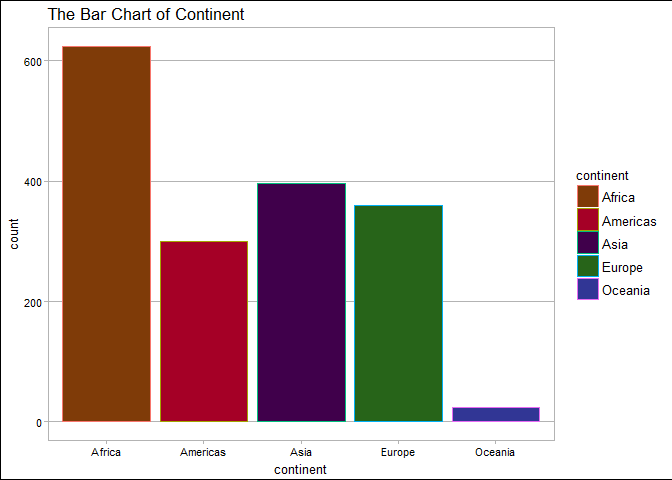
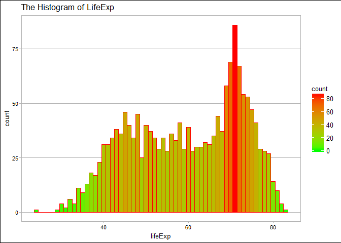
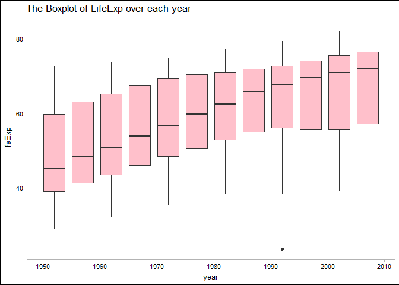
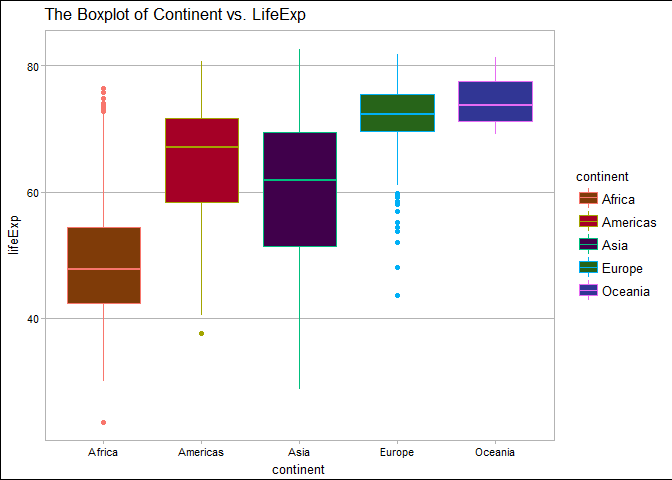
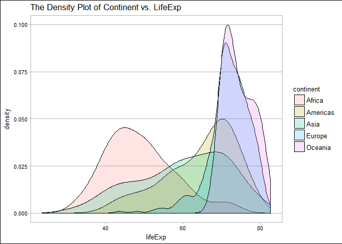
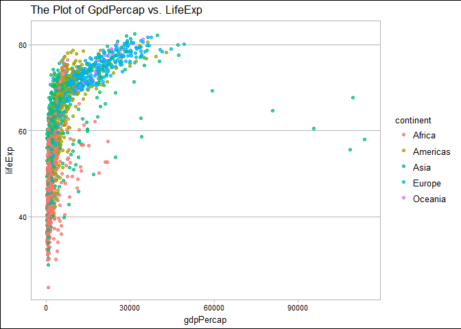
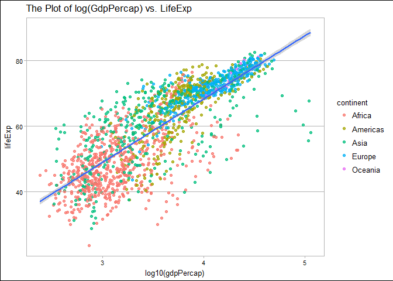
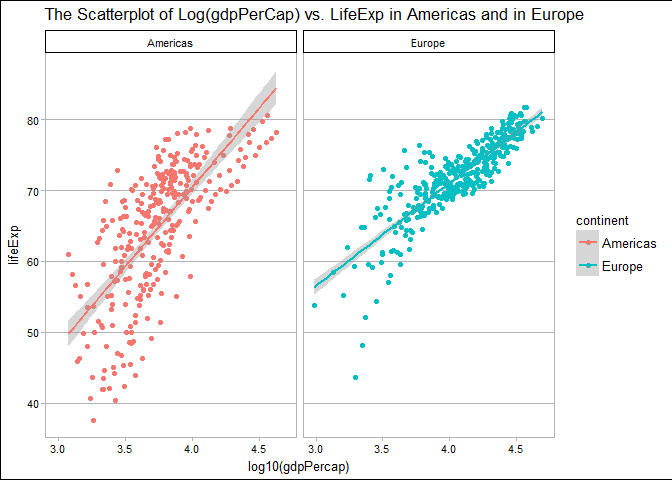
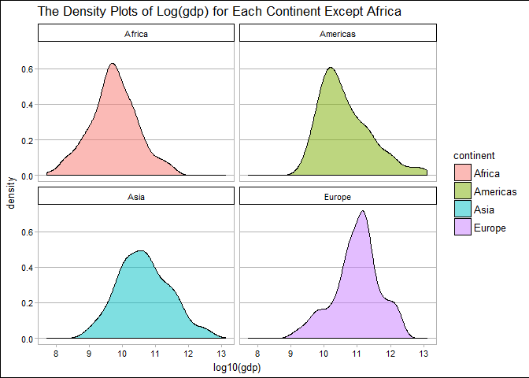
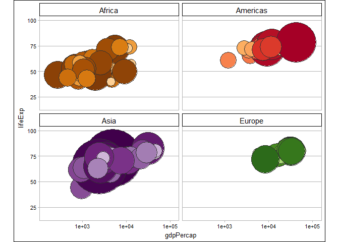

STAT545 HW02
================
Xinmiao Wang
2017-09-24

Bring Rectangular Data in
=========================

In this module, we intend to explore Gapminder data and practice the functions in dplyr, which can be loaded from gapminder package and tidyverse package in R. Please make it sure that those package have been installed before we load them.

Install `gapminder` from CRAN:

``` r
install.packages("gapminder")
```

Install `tidyverse` from CRAN:

``` r
install.packages("tidyverse")
```

Here, we load those two packages.

``` r
#load packages
library(gapminder)
library(tidyverse)
```

    ## Loading tidyverse: ggplot2
    ## Loading tidyverse: tibble
    ## Loading tidyverse: tidyr
    ## Loading tidyverse: readr
    ## Loading tidyverse: purrr
    ## Loading tidyverse: dplyr

    ## Conflicts with tidy packages ----------------------------------------------

    ## filter(): dplyr, stats
    ## lag():    dplyr, stats

``` r
library(ggthemes)
```

Smell Test the Data
===================

### Is it a data.frame, a matrix, a vector, a list?

``` r
gapminder
```

    ## # A tibble: 1,704 × 6
    ##        country continent  year lifeExp      pop gdpPercap
    ##         <fctr>    <fctr> <int>   <dbl>    <int>     <dbl>
    ## 1  Afghanistan      Asia  1952  28.801  8425333  779.4453
    ## 2  Afghanistan      Asia  1957  30.332  9240934  820.8530
    ## 3  Afghanistan      Asia  1962  31.997 10267083  853.1007
    ## 4  Afghanistan      Asia  1967  34.020 11537966  836.1971
    ## 5  Afghanistan      Asia  1972  36.088 13079460  739.9811
    ## 6  Afghanistan      Asia  1977  38.438 14880372  786.1134
    ## 7  Afghanistan      Asia  1982  39.854 12881816  978.0114
    ## 8  Afghanistan      Asia  1987  40.822 13867957  852.3959
    ## 9  Afghanistan      Asia  1992  41.674 16317921  649.3414
    ## 10 Afghanistan      Asia  1997  41.763 22227415  635.3414
    ## # ... with 1,694 more rows

``` r
str(gapminder)
```

    ## Classes 'tbl_df', 'tbl' and 'data.frame':    1704 obs. of  6 variables:
    ##  $ country  : Factor w/ 142 levels "Afghanistan",..: 1 1 1 1 1 1 1 1 1 1 ...
    ##  $ continent: Factor w/ 5 levels "Africa","Americas",..: 3 3 3 3 3 3 3 3 3 3 ...
    ##  $ year     : int  1952 1957 1962 1967 1972 1977 1982 1987 1992 1997 ...
    ##  $ lifeExp  : num  28.8 30.3 32 34 36.1 ...
    ##  $ pop      : int  8425333 9240934 10267083 11537966 13079460 14880372 12881816 13867957 16317921 22227415 ...
    ##  $ gdpPercap: num  779 821 853 836 740 ...

-   A tibble, because we load the `tidyverse` package

-   A data.frame by the classes shown in `str(gapminder)`

### What’s its class?

``` r
class(gapminder)
```

    ## [1] "tbl_df"     "tbl"        "data.frame"

-   The class of gapminder includes tbl\_df, tbl, data.frame.

### How many variables/columns?

``` r
ncol(gapminder)
```

    ## [1] 6

-   There are 6 variables.

### How many rows/observations?

``` r
nrow(gapminder)
```

    ## [1] 1704

-   There are 1704 observations.

### Can you get these facts about “extent” or “size” in more than one way? Can you imagine different functions being useful in different contexts?

``` r
dim(gapminder) # number of observations and number of variables
```

    ## [1] 1704    6

``` r
length(gapminder) # number of variables
```

    ## [1] 6

-   `dim()`: the number of observations and the number of variables

-   `str()`: the number of observations and the number of variables

-   `length()`: the number of variables

### What data type is each variable?

``` r
attach(gapminder)
a <- rbind(names(gapminder), c(typeof(country), typeof(continent), typeof(year), typeof(lifeExp), typeof(pop), typeof(gdpPercap)))
as.data.frame(a, row.names=c("Variables", "Data Type")) #Data type of each variable
```

    ##                V1        V2      V3      V4      V5        V6
    ## Variables country continent    year lifeExp     pop gdpPercap
    ## Data Type integer   integer integer  double integer    double

-   Integer: country, continent, year, pop

-   Numeric: lifeExp, gdpPercap

<Notes> Here, the data types of variables country and continent are integer, even though we can see their values are characters not integer numbers. I think it is because that these two variables are treated as factors with order when we import the data into R. The integers represent the levels. For example, for country, 1 represents Afghanistan, and for continent, 1 represent Africa. You can check it by using `str(gapminder)`, `levels(gapminder$country)` and `levels(gapminder$continent)`.

Explore individual variables
============================

### Categorical Variable: Continent

Here are the summary table and the barchart for Continent.

There are six continents where we collected data, including Africa, Americas, Asia, Europe and Oceania. We collected the most number of data from Africa. The smallest number of data were collect in Oceania. From the barchart below, we can observe the distribution of continent more clearly.

``` r
summary(continent)
```

    ##   Africa Americas     Asia   Europe  Oceania 
    ##      624      300      396      360       24

``` r
ggplot(gapminder, aes(x=continent))+
  geom_bar(aes(color=continent), fill=continent_colors)+
  theme_calc()+
  ggtitle("The Bar Chart of Continent")
```



### Quantitative Variable: LifeExp

Here are the summary data and the histogram for LifeExp.

The range of lifeExp is from 23.599 to 82.603. The mean of LifeExp is 59.4744394 with standard derivation 12.9171074, and the Median is 60.7125. From the histogram, we can observe the mode of lifeExp is around 70, the shape of its distribution is a little bit left-skewed. Based in the histogram, I suspect the minimum of lifeExp might be an outliter. However, by the 1.5 IQR rule, the minimum value is considerable.

``` r
summary(lifeExp)
```

    ##    Min. 1st Qu.  Median    Mean 3rd Qu.    Max. 
    ##   23.60   48.20   60.71   59.47   70.85   82.60

``` r
sd(lifeExp)
```

    ## [1] 12.91711

``` r
ggplot(gapminder, aes(x=lifeExp))+
  geom_histogram(binwidth = 1,col="red", aes(fill=..count..))+
  scale_fill_gradient("count", low = "green", high = "red")+
  theme_calc()+
  ggtitle("The Histogram of LifeExp")
```



Explore various plot types
==========================

Life Expectancy vs. Year
------------------------

Here is a boxplot of life expectancy among every five years from 1952 to 2007. From the boxplot, we can see the increasing trend of the average life expectancy all over the world.



Life Expectancy vs. Contient
----------------------------

Here is the boxplot of Continent vs. Life Expectancy. We can observe that the average of life expectancy in Oceania is the highest one. However, we are nor sure yet based on the boxplot, which continent has the highest expectancy than any other continents, because the box overlap with each other.

``` r
ggplot(gapminder, aes(x=continent, y=lifeExp))+
  geom_boxplot(aes(color=continent), fill=continent_colors)+
  theme_calc()+
  ggtitle("The Boxplot of LifeExp in each Continent")
```



In addition, I plot the density of lifeExp for each continent. We can compare the distribution of lifeExp in each continent.

``` r
ggplot(gapminder, aes(x = lifeExp, fill = continent)) +
  geom_density(alpha = 0.2, lwd=0.65)+
  theme_calc()+
  ggtitle("The Density Plot of Continent vs. LifeExp")
```



Life Expectancy vs. GDP per capita
----------------------------------

First, I plot the gdpPercap versus LifeExp. We observe a shape of logarithm function in the plot.



Hence, I plot the log of gdpPercap versus LifeExp instead, which show us a linear relationship between these two variables.



Use filter(), select() and %&gt;%
=================================

Here is the scatter plot of log(gdpPercap) vs. LifeExp in Americas and in Europe. They both show us a positive linear relationship between log(gdpPercap) and lifeExp.

``` r
gapminder %>% 
  filter(continent %in% c("Americas", "Europe") ) %>% 
  select(continent, country, lifeExp, gdpPercap) %>% 
  ggplot(aes(x=log10(gdpPercap), y=lifeExp, color=continent))+
  geom_point()+
  geom_smooth(method="lm")+
  facet_wrap(~continent)+
  theme_calc()+
  ggtitle("The Scatterplot of Log(gdpPerCap) vs. LifeExp in Americas and in Europe")
```



Here is the density plots of Log(gdp) for each continent except Africa.

``` r
gapminder %>% 
  filter(continent != "Oceania") %>% 
  select(continent, year, pop, gdpPercap) %>% 
  mutate(gdp = gdpPercap*pop) %>% 
  ggplot(aes(x=log10(gdp), fill=continent))+
  geom_density(alpha=0.5)+
  facet_wrap(~continent)+
  theme_calc()+
  ggtitle("The Density Plots of Log(gdp) for Each Continent Except Africa")
```



I just found the interesting plot from ggplot tutorial and try to plot it.

``` r
jYear <- 2007 # this can obviously be changed
jPch <- 21
jDarkGray <- 'grey20'
jXlim <- c(150, 115000)
jYlim <- c(16, 100)

gapminder %>%
  filter(continent != "Oceania", year == jYear) %>% 
  ggplot(aes(x = gdpPercap, y = lifeExp)) +
  scale_x_log10(limits = jXlim) + ylim(jYlim) +
  geom_point(aes(size = sqrt(pop/pi)), pch = jPch, color = jDarkGray,
             show.legend = FALSE) + 
  scale_size_continuous(range=c(1,40)) +
  facet_wrap(~ continent) + coord_fixed(ratio = 1/43) +
  aes(fill = country) + scale_fill_manual(values = country_colors) +
  theme_calc() + theme(strip.text = element_text(size = rel(1.1)))
```



Extra Question
==============

``` r
extra_dat <- filter(gapminder, country == c("Rwanda", "Afghanistan")) %>% 
  arrange(year)
my_dat <- filter(gapminder, country %in% c("Rwanda", "Afghanistan")) %>% 
  arrange(year)
nrow(extra_dat)
```

    ## [1] 12

``` r
nrow(my_dat)
```

    ## [1] 24

The answer of this question is No. The command, `filter(gapminder, country == c("Rwanda", "Afghanistan"))`, give us only 12 observations. However, there are actually 24 observations. This is because, R will compare two consecutive observations with each time when you use `country==c("Rwanda", "Afghanistan")`. For example, R will compare the country of first observation with Rwanda and the country of second observation with Afghanistan. We can also check it from the tables below.

``` r
knitr::kable(extra_dat)
```

| country     | continent |  year|  lifeExp|       pop|  gdpPercap|
|:------------|:----------|-----:|--------:|---------:|----------:|
| Rwanda      | Africa    |  1952|   40.000|   2534927|   493.3239|
| Afghanistan | Asia      |  1957|   30.332|   9240934|   820.8530|
| Rwanda      | Africa    |  1962|   43.000|   3051242|   597.4731|
| Afghanistan | Asia      |  1967|   34.020|  11537966|   836.1971|
| Rwanda      | Africa    |  1972|   44.600|   3992121|   590.5807|
| Afghanistan | Asia      |  1977|   38.438|  14880372|   786.1134|
| Rwanda      | Africa    |  1982|   46.218|   5507565|   881.5706|
| Afghanistan | Asia      |  1987|   40.822|  13867957|   852.3959|
| Rwanda      | Africa    |  1992|   23.599|   7290203|   737.0686|
| Afghanistan | Asia      |  1997|   41.763|  22227415|   635.3414|
| Rwanda      | Africa    |  2002|   43.413|   7852401|   785.6538|
| Afghanistan | Asia      |  2007|   43.828|  31889923|   974.5803|

``` r
knitr::kable(my_dat)
```

| country     | continent |  year|  lifeExp|       pop|  gdpPercap|
|:------------|:----------|-----:|--------:|---------:|----------:|
| Afghanistan | Asia      |  1952|   28.801|   8425333|   779.4453|
| Rwanda      | Africa    |  1952|   40.000|   2534927|   493.3239|
| Afghanistan | Asia      |  1957|   30.332|   9240934|   820.8530|
| Rwanda      | Africa    |  1957|   41.500|   2822082|   540.2894|
| Afghanistan | Asia      |  1962|   31.997|  10267083|   853.1007|
| Rwanda      | Africa    |  1962|   43.000|   3051242|   597.4731|
| Afghanistan | Asia      |  1967|   34.020|  11537966|   836.1971|
| Rwanda      | Africa    |  1967|   44.100|   3451079|   510.9637|
| Afghanistan | Asia      |  1972|   36.088|  13079460|   739.9811|
| Rwanda      | Africa    |  1972|   44.600|   3992121|   590.5807|
| Afghanistan | Asia      |  1977|   38.438|  14880372|   786.1134|
| Rwanda      | Africa    |  1977|   45.000|   4657072|   670.0806|
| Afghanistan | Asia      |  1982|   39.854|  12881816|   978.0114|
| Rwanda      | Africa    |  1982|   46.218|   5507565|   881.5706|
| Afghanistan | Asia      |  1987|   40.822|  13867957|   852.3959|
| Rwanda      | Africa    |  1987|   44.020|   6349365|   847.9912|
| Afghanistan | Asia      |  1992|   41.674|  16317921|   649.3414|
| Rwanda      | Africa    |  1992|   23.599|   7290203|   737.0686|
| Afghanistan | Asia      |  1997|   41.763|  22227415|   635.3414|
| Rwanda      | Africa    |  1997|   36.087|   7212583|   589.9445|
| Afghanistan | Asia      |  2002|   42.129|  25268405|   726.7341|
| Rwanda      | Africa    |  2002|   43.413|   7852401|   785.6538|
| Afghanistan | Asia      |  2007|   43.828|  31889923|   974.5803|
| Rwanda      | Africa    |  2007|   46.242|   8860588|   863.0885|

Reference
=========

-   [STAT545: cm005 Notes and Exercises](http://stat545.com/cm005-notes_and_exercises.html)
-   [ggplot2 Tutorial](https://github.com/jennybc/ggplot2-tutorial)
-   [Gapminder README.md by jennybc](https://github.com/jennybc/gapminder/blob/master/README.md)
