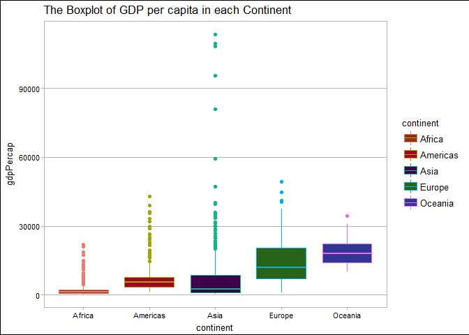

STAT HW03
================
Xinmiao Wang
2017-10-01

Navigation
==========

-   The main repo for homework: [here](https://github.com/xinmiaow/STAT545-hw-Wang-Xinmiao)

-   Requirement for Homework 03: click [here](http://stat545.com/hw03_dplyr-and-more-ggplot2.html)

-   hw03 folder: [here](https://github.com/xinmiaow/STAT545-hw-Wang-Xinmiao/tree/master/hw03).

-   Files inside hw03:

1.  \[README.md\]
2.  \[hw03\_Gapminder.md\]

Induction
=========

In this module, the main goal is to pracitce dplyr as our manipulation tool with ggplot2 as our visulization tool. We conitnue to explore Gapminder dataset. Those can be loaded from tidyverse package and gapminder package in R. Please make it sure that those package have been installed before we load them.

Load Package
============

Install `gapminder` from CRAN:

``` r
install.packages("gapminder")
```

Install `tidyverse` from CRAN:

``` r
install.packages("tidyverse")
```

Here, we load those two packages.

``` r
#load packages
library(gapminder)
library(tidyverse)
```

    ## Loading tidyverse: ggplot2
    ## Loading tidyverse: tibble
    ## Loading tidyverse: tidyr
    ## Loading tidyverse: readr
    ## Loading tidyverse: purrr
    ## Loading tidyverse: dplyr

    ## Conflicts with tidy packages ----------------------------------------------

    ## filter(): dplyr, stats
    ## lag():    dplyr, stats

``` r
library(ggthemes)
```

Get the maximum and minimum of GDP per capita for all continents
================================================================

``` r
gapminder %>% 
  group_by(continent) %>% 
  summarise(Max=max(gdpPercap), Min=min(gdpPercap)) %>% 
  knitr::kable()
```

| continent |        Max|         Min|
|:----------|----------:|-----------:|
| Africa    |   21951.21|    241.1659|
| Americas  |   42951.65|   1201.6372|
| Asia      |  113523.13|    331.0000|
| Europe    |   49357.19|    973.5332|
| Oceania   |   34435.37|  10039.5956|

``` r
ggplot(gapminder, aes(x=continent, y=gdpPercap, color = continent)) +
  geom_point()+ 
  theme_calc()+
  ggtitle("GDP per cap by continent")
```


Look at the spread of GDP per capita within the continents.
===========================================================

``` r
gapminder %>% 
  group_by(continent) %>% 
  summarise(SD.gdp=sd(gdpPercap), IQR.gdp=IQR(gdpPercap)) %>% 
  knitr::kable()
```

| continent |     SD.gdp|    IQR.gdp|
|:----------|----------:|----------:|
| Africa    |   2827.930|   1616.170|
| Americas  |   6396.764|   4402.431|
| Asia      |  14045.373|   7492.262|
| Europe    |   9355.213|  13248.301|
| Oceania   |   6358.983|   8072.258|

``` r
ggplot(gapminder, aes(x=gdpPercap, fill=continent))+
  geom_density(alpha = 0.2, lwd=0.65)+
  theme_calc()+
  ggtitle("The Density Plot of gdpPercap for each continents")
```


``` r
ggplot(gapminder, aes(x=continent, y=gdpPercap, color=continent))+
  geom_boxplot(fill=continent_colors)+
  theme_calc()+
  ggtitle("The Boxplot of GDP per capita in each Continent")
```



Compute a trimmed mean of life expectancy for different years. Or a weighted mean, weighting by population.
===========================================================================================================

How is life expectancy changing over time on different continents?
==================================================================

``` r
#lag

gapminder %>% 
  ggplot(aes(x=year, y=lifeExp, color=continent))+
  geom_point(aes(group=continent))+
  geom_smooth(se=FALSE)+
  facet_wrap(~continent)+
  theme_calc()+
  ggtitle("The plot of lifeExp over time in each Continent")
```

    ## `geom_smooth()` using method = 'loess'


Find countries with interesting stories
=======================================
