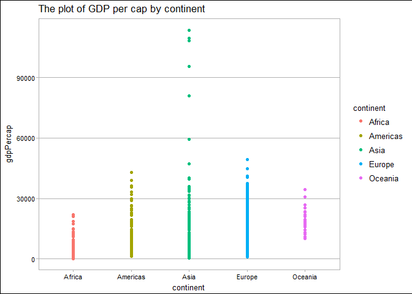
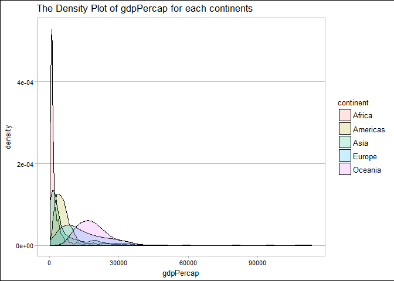
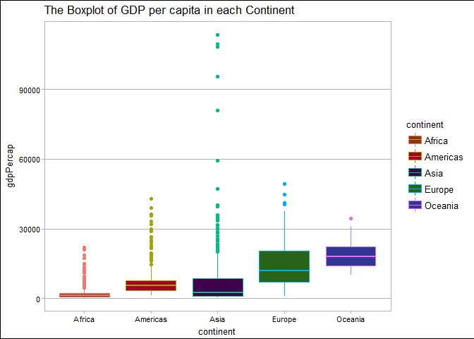
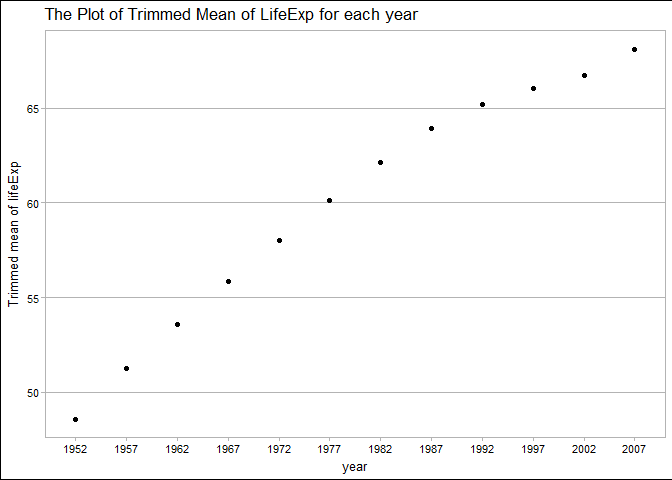
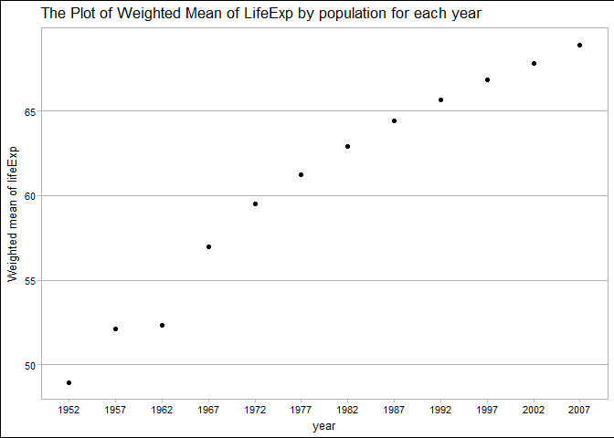
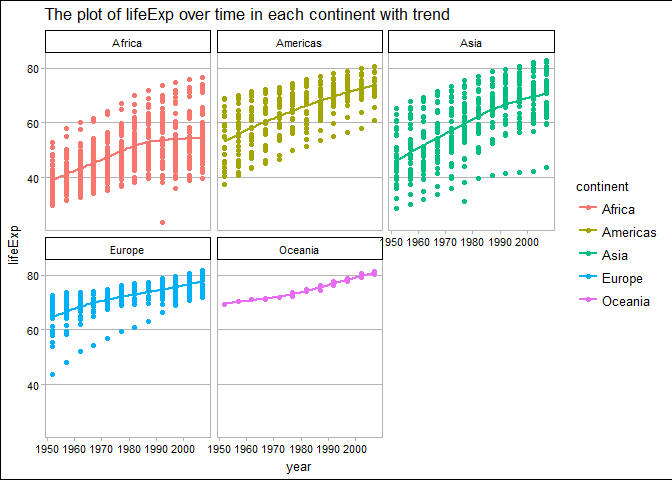
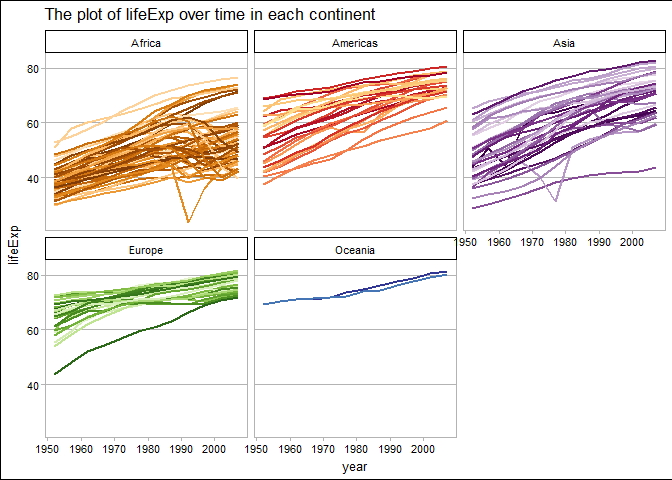

STAT HW03
================
Xinmiao Wang
2017-10-02

Navigation
==========

-   The main repo for homework: [here](https://github.com/xinmiaow/STAT545-hw-Wang-Xinmiao)

-   Requirement for Homework 03: click [here](http://stat545.com/hw03_dplyr-and-more-ggplot2.html)

-   hw03 folder: [here](https://github.com/xinmiaow/STAT545-hw-Wang-Xinmiao/tree/master/hw03).

-   Files inside hw03:

1.  [README.md](https://github.com/xinmiaow/STAT545-hw-Wang-Xinmiao/blob/master/hw03/README.md)
2.  [hw03\_Gapminder.md](https://github.com/xinmiaow/STAT545-hw-Wang-Xinmiao/blob/master/hw03/hw03_Gapminder.md)

Induction
=========

In this module, the main goal is to practice dplyr as our manipulation tool with ggplot2 as our visualization tool. We continue to explore Gapminder dataset. Those can be loaded from tidyverse package and gapminder package in R. Please make it sure that those package have been installed before we load them.

Load Package
============

Install `gapminder` from CRAN:

``` r
install.packages("gapminder")
```

Install `tidyverse` from CRAN:

``` r
install.packages("tidyverse")
```

Here, we load packages that we gonna use later.

``` r
#load packages
library(gapminder)
library(tidyverse)
```

    ## Loading tidyverse: ggplot2
    ## Loading tidyverse: tibble
    ## Loading tidyverse: tidyr
    ## Loading tidyverse: readr
    ## Loading tidyverse: purrr
    ## Loading tidyverse: dplyr

    ## Conflicts with tidy packages ----------------------------------------------

    ## filter(): dplyr, stats
    ## lag():    dplyr, stats

``` r
library(ggthemes)
```

Get the maximum and minimum of GDP per capita for all continents
================================================================

The table below summarizes the maximum and minimum of GDP per capita for each continents.

We can see the maximum of GDP per capita in Asia is the largest one among five continents, along with a widest range. Both maximum and minimum of GDP per capita in Africa are the smallest among these continents. The GDP per capita in Oceania has the narrowest range.

The plot following with the table also tells us the information.

``` r
gapminder %>% 
  group_by(continent) %>% 
  summarise(Max=max(gdpPercap), Min=min(gdpPercap)) %>% 
  knitr::kable()
```

| continent |        Max|         Min|
|:----------|----------:|-----------:|
| Africa    |   21951.21|    241.1659|
| Americas  |   42951.65|   1201.6372|
| Asia      |  113523.13|    331.0000|
| Europe    |   49357.19|    973.5332|
| Oceania   |   34435.37|  10039.5956|

``` r
ggplot(gapminder, aes(x=continent, y=gdpPercap, color = continent)) +
  geom_point()+ 
  theme_calc()+
  ggtitle("The plot of GDP per cap by continent")
```



Look at the spread of GDP per capita within the continents
==========================================================

Firstly, I make a density plot for gdpPercap in each continent, to explore the spread of GDP per capita within the continents. I found that most of the plots are extremely skewed. Hence, I decided to use IQR along with boxplots to show the spread, but I also calculate the standard deviation of gdpPercap in each continent.

``` r
ggplot(gapminder, aes(x=gdpPercap, fill=continent))+
  geom_density(alpha = 0.2, lwd=0.65)+
  theme_calc()+
  ggtitle("The Density Plot of gdpPercap for each continent")
```



The table below show us the standard deviation and IQR for gdpPercap in each continent.Also, the side-by-side boxplot is displayed. We can compare the spread of gdpPercap in each continent by comparing the length of each box.

``` r
gapminder %>% 
  group_by(continent) %>% 
  summarise(SD.gdp=sd(gdpPercap), IQR.gdp=IQR(gdpPercap)) %>% 
  knitr::kable()
```

| continent |     SD.gdp|    IQR.gdp|
|:----------|----------:|----------:|
| Africa    |   2827.930|   1616.170|
| Americas  |   6396.764|   4402.431|
| Asia      |  14045.373|   7492.262|
| Europe    |   9355.213|  13248.301|
| Oceania   |   6358.983|   8072.258|

``` r
ggplot(gapminder, aes(x=continent, y=gdpPercap, color=continent))+
  geom_boxplot(fill=continent_colors)+
  theme_calc()+
  ggtitle("The Boxplot of GDP per capita in each Continent")
```



Compute a trimmed mean of life expectancy for different years. Or a weighted mean, weighting by population
==========================================================================================================

Here is the table and plot about trimmed mean of life expectancy in each year. I use the argument `trim=0.1` in the function `mean`.

``` r
gapminder %>% 
  group_by(year) %>%
  summarise(trimmed_mean=mean(lifeExp,trim=0.1)) %>% 
  knitr::kable()
```

|  year|  trimmed\_mean|
|-----:|--------------:|
|  1952|       48.57668|
|  1957|       51.26888|
|  1962|       53.58075|
|  1967|       55.86538|
|  1972|       58.01444|
|  1977|       60.10206|
|  1982|       62.11694|
|  1987|       63.92106|
|  1992|       65.18519|
|  1997|       66.01736|
|  2002|       66.71641|
|  2007|       68.11489|

``` r
gapminder %>% 
  group_by(year) %>% 
  summarise(trimmed_mean=mean(lifeExp,trim=0.1)) %>% 
  ggplot(aes(x=factor(year), y=trimmed_mean))+
  geom_point()+
  labs(x="year", y="Trimmed mean of lifeExp")+
  theme_calc()+
  ggtitle("The Plot of Trimmed Mean of LifeExp for each year")
```



Here is the table and plot about weighted mean of life expectancy by population in each year. I use the function `weighted.mean` to calculate that.

``` r
gapminder %>% 
  group_by(year) %>% 
  summarise(weighted_mean=weighted.mean(lifeExp, pop)) %>% 
  knitr::kable()
```

|  year|  weighted\_mean|
|-----:|---------------:|
|  1952|        48.94424|
|  1957|        52.12189|
|  1962|        52.32438|
|  1967|        56.98431|
|  1972|        59.51478|
|  1977|        61.23726|
|  1982|        62.88176|
|  1987|        64.41635|
|  1992|        65.64590|
|  1997|        66.84934|
|  2002|        67.83904|
|  2007|        68.91909|

``` r
gapminder %>%
  group_by(year) %>%
  summarise(weighted_mean=weighted.mean(lifeExp, pop)) %>%
  ggplot(aes(x=factor(year), y=weighted_mean))+
  geom_point()+
  labs(x="year", y="Weighted mean of lifeExp")+
  theme_calc()+
  ggtitle("The Plot of Weighted Mean of LifeExp by population for each year")
```



How is life expectancy changing over time on different continents?
==================================================================

Here, I make a table which contains the difference of life expectancy between each two contiguous years for each continents.I also plot the life expectancy over time in each continent with a smooth line. Both of them tell us the increasing trend of life expectancy over time in each continent.

``` r
gapminder %>% 
  group_by(country) %>%  
  mutate(diff.lifeExp=lifeExp-lag(lifeExp)) %>% 
  group_by(continent, year) %>% 
  summarise(Diff=mean(diff.lifeExp, na.rm = T)) %>% 
  knitr::kable()
```

| continent |  year|        Diff|
|:----------|-----:|-----------:|
| Africa    |  1952|         NaN|
| Africa    |  1957|   2.1308462|
| Africa    |  1962|   2.0530962|
| Africa    |  1967|   2.0150962|
| Africa    |  1972|   2.1164038|
| Africa    |  1977|   2.1294808|
| Africa    |  1982|   2.0124423|
| Africa    |  1987|   1.7519231|
| Africa    |  1992|   0.2847885|
| Africa    |  1997|  -0.0313077|
| Africa    |  2002|  -0.2730385|
| Africa    |  2007|   1.4808077|
| Americas  |  1952|         NaN|
| Americas  |  1957|   2.6804400|
| Americas  |  1962|   2.4384800|
| Americas  |  1967|   2.0121600|
| Americas  |  1972|   1.9840000|
| Americas  |  1977|   1.9966400|
| Americas  |  1982|   1.8372800|
| Americas  |  1987|   1.8618800|
| Americas  |  1992|   1.4776400|
| Americas  |  1997|   1.5821200|
| Americas  |  2002|   1.2715600|
| Americas  |  2007|   1.1860800|
| Asia      |  1952|         NaN|
| Asia      |  1957|   3.0041503|
| Asia      |  1962|   2.2446788|
| Asia      |  1967|   3.1004170|
| Asia      |  1972|   2.6556291|
| Asia      |  1977|   2.2912873|
| Asia      |  1982|   3.0073830|
| Asia      |  1987|   2.2332424|
| Asia      |  1992|   1.6860303|
| Asia      |  1997|   1.4833030|
| Asia      |  2002|   1.2133636|
| Asia      |  2007|   1.4946061|
| Europe    |  1952|         NaN|
| Europe    |  1957|   2.2945667|
| Europe    |  1962|   1.8361667|
| Europe    |  1967|   1.1983667|
| Europe    |  1972|   1.0374333|
| Europe    |  1977|   1.1627333|
| Europe    |  1982|   0.8686333|
| Europe    |  1987|   0.8357667|
| Europe    |  1992|   0.7979333|
| Europe    |  1997|   1.0650667|
| Europe    |  2002|   1.1954333|
| Europe    |  2007|   0.9480000|
| Oceania   |  1952|         NaN|
| Oceania   |  1957|   1.0400000|
| Oceania   |  1962|   0.7900000|
| Oceania   |  1967|   0.2250000|
| Oceania   |  1972|   0.6000000|
| Oceania   |  1977|   0.9450000|
| Oceania   |  1982|   1.4350000|
| Oceania   |  1987|   1.0300000|
| Oceania   |  1992|   1.6250000|
| Oceania   |  1997|   1.2450000|
| Oceania   |  2002|   1.5500000|
| Oceania   |  2007|   0.9795000|

``` r
ggplot(gapminder, aes(x=year, y=lifeExp, color=continent))+
  geom_point(aes(group=continent))+
  geom_smooth(se=FALSE)+
  facet_wrap(~continent)+
  theme_calc()+
  ggtitle("The plot of lifeExp over time in each continent with trend")
```

    ## `geom_smooth()` using method = 'loess'



Find countries with interesting stories
=======================================

(Continuing last part) I still plot the life expectancy over year in each continent, but use the `country_colors` to distinguish the countries in each continent. We can find overall the life expectancy also has an increasing trend in each country.

``` r
gapminder %>% 
  ggplot(aes(x=year, y=lifeExp, group=country))+
  geom_line(lwd=0.75, show.legend=FALSE)+
  aes(color = country)+ 
  scale_color_manual(values = country_colors)+
  facet_wrap(~continent)+
  theme_calc()+
  ggtitle("The plot of lifeExp over time in each continent")
```



Process Report
==============

Overall, I think the assignment is easy, and most of functions have been covered by lectures. The ggplot2 tutorial is also a very useful resource to discover the functions in ggplot2.

There is one problem I did not solve, which is about the side-by-side plot and table. I found a useful link to do that, but it seems to be very complicated. We need to save the plots and tables and then using the css syntax to organize them in a table. I will try it late if I have any spare time. However, I also wonder any other simpler way to solve it.

Reference
=========

-   [ggplot2: Stat Summary](http://ggplot2.tidyverse.org/reference/stat_summary.html)

-   [ggplot2 Tutorial](https://github.com/jennybc/ggplot2-tutorial)

-   [lotr-tidy: xtable](https://github.com/jennybc/lotr-tidy/blob/master/01-intro.Rmd)
