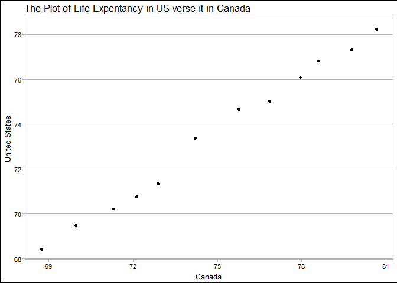

STAT HW04
================
Xinmiao Wang
2017-10-08

Navigation
==========

-   The main repo for homework: [here](https://github.com/xinmiaow/STAT545-hw-Wang-Xinmiao)

-   Requirement for Homework 04: click [here](http://stat545.com/hw04_tidy-data-joins.html)

-   hw04 folder: [here](https://github.com/xinmiaow/STAT545-hw-Wang-Xinmiao/tree/master/hw04).

-   Files inside hw04:

1.  [README.md](https://github.com/xinmiaow/STAT545-hw-Wang-Xinmiao/blob/master/hw04/README.md)
2.  [hw04\_Gapminder.Rmd](https://github.com/xinmiaow/STAT545-hw-Wang-Xinmiao/blob/master/hw04/hw04_Gapminder.Rmd)
3.  [hw04\_Gapminder.md](https://github.com/xinmiaow/STAT545-hw-Wang-Xinmiao/blob/master/hw04/hw04_Gapminder.md)

Induction
=========

The goal of this homework is to solidify your data wrangling skills by working some realistic problems in the grey area between data aggregation and data reshaping.

In this Homework, we still work on Gapminder dataset, and are going to exploring the dataset by reshaping it. So, We need to load the packages, `gapminder`, `tidyverse` and `devtools`.

Load Package
============

Install `gapminder` from CRAN:

``` r
install.packages("gapminder")
```

Install `tidyverse` from CRAN:

``` r
install.packages("tidyverse")
```

Install `devtools` from CRAN:

``` r
install.packages("devtools")
```

Here, we load packages that we gonna use later.

``` r
#load packages
library(tidyverse)
```

    ## Loading tidyverse: ggplot2
    ## Loading tidyverse: tibble
    ## Loading tidyverse: tidyr
    ## Loading tidyverse: readr
    ## Loading tidyverse: purrr
    ## Loading tidyverse: dplyr

    ## Conflicts with tidy packages ----------------------------------------------

    ## filter(): dplyr, stats
    ## lag():    dplyr, stats

``` r
library(gapminder)
library(devtools)
library(ggthemes)
library(geonames)
```

    ## No geonamesUsername set. See http://geonames.wordpress.com/2010/03/16/ddos-part-ii/ and set one with options(geonamesUsername="foo") for some services to work

General data reshaping and relationship to aggregation
======================================================

Activity 2
----------

\*Make a tibble with one row per year and columns for life expectancy for two or more countries.

-   Use knitr::kable() to make this table look pretty in your rendered homework.
-   Take advantage of this new data shape to scatterplot life expectancy for one country against that of another.

Here, I select all the countries in Americas and spread the life expectancy for each country in each year. And then, I plot the life expectancy in Canada aganist the life expectancy in United States. We can observe a positive linear relatinship between them along with an increasing trend.

``` r
dat1 <- gapminder %>% 
  filter(continent == "Americas") %>%
  select(country, lifeExp, year) %>% 
  spread(country, lifeExp) %>% 
  tbl_df()

knitr::kable(dat1)
```

|  year|  Argentina|  Bolivia|  Brazil|  Canada|   Chile|  Colombia|  Costa Rica|    Cuba|  Dominican Republic|  Ecuador|  El Salvador|  Guatemala|   Haiti|  Honduras|  Jamaica|  Mexico|  Nicaragua|  Panama|  Paraguay|    Peru|  Puerto Rico|  Trinidad and Tobago|  United States|  Uruguay|  Venezuela|
|-----:|----------:|--------:|-------:|-------:|-------:|---------:|-----------:|-------:|-------------------:|--------:|------------:|----------:|-------:|---------:|--------:|-------:|----------:|-------:|---------:|-------:|------------:|--------------------:|--------------:|--------:|----------:|
|  1952|     62.485|   40.414|  50.917|  68.750|  54.745|    50.643|      57.206|  59.421|              45.928|   48.357|       45.262|     42.023|  37.579|    41.912|   58.530|  50.789|     42.314|  55.191|    62.649|  43.902|       64.280|               59.100|         68.440|   66.071|     55.088|
|  1957|     64.399|   41.890|  53.285|  69.960|  56.074|    55.118|      60.026|  62.325|              49.828|   51.356|       48.570|     44.142|  40.696|    44.665|   62.610|  55.190|     45.432|  59.201|    63.196|  46.263|       68.540|               61.800|         69.490|   67.044|     57.907|
|  1962|     65.142|   43.428|  55.665|  71.300|  57.924|    57.863|      62.842|  65.246|              53.459|   54.640|       52.307|     46.954|  43.590|    48.041|   65.610|  58.299|     48.632|  61.817|    64.361|  49.096|       69.620|               64.900|         70.210|   68.253|     60.770|
|  1967|     65.634|   45.032|  57.632|  72.130|  60.523|    59.963|      65.424|  68.290|              56.751|   56.678|       55.855|     50.016|  46.243|    50.924|   67.510|  60.110|     51.884|  64.071|    64.951|  51.445|       71.100|               65.400|         70.760|   68.468|     63.479|
|  1972|     67.065|   46.714|  59.504|  72.880|  63.441|    61.623|      67.849|  70.723|              59.631|   58.796|       58.207|     53.738|  48.042|    53.884|   69.000|  62.361|     55.151|  66.216|    65.815|  55.448|       72.160|               65.900|         71.340|   68.673|     65.712|
|  1977|     68.481|   50.023|  61.489|  74.210|  67.052|    63.837|      70.750|  72.649|              61.788|   61.310|       56.696|     56.029|  49.923|    57.402|   70.110|  65.032|     57.470|  68.681|    66.353|  58.447|       73.440|               68.300|         73.380|   69.481|     67.456|
|  1982|     69.942|   53.859|  63.336|  75.760|  70.565|    66.653|      73.450|  73.717|              63.727|   64.342|       56.604|     58.137|  51.461|    60.909|   71.210|  67.405|     59.298|  70.472|    66.874|  61.406|       73.750|               68.832|         74.650|   70.805|     68.557|
|  1987|     70.774|   57.251|  65.205|  76.860|  72.492|    67.768|      74.752|  74.174|              66.046|   67.231|       63.154|     60.782|  53.636|    64.492|   71.770|  69.498|     62.008|  71.523|    67.378|  64.134|       74.630|               69.582|         75.020|   71.918|     70.190|
|  1992|     71.868|   59.957|  67.057|  77.950|  74.126|    68.421|      75.713|  74.414|              68.457|   69.613|       66.798|     63.373|  55.089|    66.399|   71.766|  71.455|     65.843|  72.462|    68.225|  66.458|       73.911|               69.862|         76.090|   72.752|     71.150|
|  1997|     73.275|   62.050|  69.388|  78.610|  75.816|    70.313|      77.260|  76.151|              69.957|   72.312|       69.535|     66.322|  56.671|    67.659|   72.262|  73.670|     68.426|  73.738|    69.400|  68.386|       74.917|               69.465|         76.810|   74.223|     72.146|
|  2002|     74.340|   63.883|  71.006|  79.770|  77.860|    71.682|      78.123|  77.158|              70.847|   74.173|       70.734|     68.978|  58.137|    68.565|   72.047|  74.902|     70.836|  74.712|    70.755|  69.906|       77.778|               68.976|         77.310|   75.307|     72.766|
|  2007|     75.320|   65.554|  72.390|  80.653|  78.553|    72.889|      78.782|  78.273|              72.235|   74.994|       71.878|     70.259|  60.916|    70.198|   72.567|  76.195|     72.899|  75.537|    71.752|  71.421|       78.746|               69.819|         78.242|   76.384|     73.747|

``` r
ggplot(dat1, aes(x=Canada, y=get("United States")))+
  geom_point()+
  labs(x="Canada", y="United States")+
  theme_calc()+
  ggtitle("The Plot of Life Expentancy in US verse it in Canada")
```



Join, merge, look up
====================

Activity 1
----------

-   Create a second data frame, complementary to Gapminder. Join this with (part of) Gapminder using a dplyr join function and make some observations about the process and result. Explore the different types of joins. Examples of a second data frame you could build:

-   One row per country, a country variable and one or more variables with extra info, such as language spoken, NATO membership, national animal, or capitol city. If you really want to be helpful, you could attempt to make a pull request to resolve this issue, where I would like to bring ISO country codes into the gapminder package.

I am going to use the data in `geonames` to create a new dataset which include the information of countries including Canada, United States and New Zealand.

``` r
# Part of Gapminder dataset
gapminder.part <- gapminder %>% 
  filter(country%in%c("United States", "Canada", "Mexico"), year>2000) %>%
  select(country, year, lifeExp, gdpPercap) %>% 
  tbl_df()

knitr::kable(gapminder.part)
```

| country       |  year|  lifeExp|  gdpPercap|
|:--------------|-----:|--------:|----------:|
| Canada        |  2002|   79.770|   33328.97|
| Canada        |  2007|   80.653|   36319.24|
| Mexico        |  2002|   74.902|   10742.44|
| Mexico        |  2007|   76.195|   11977.57|
| United States |  2002|   77.310|   39097.10|
| United States |  2007|   78.242|   42951.65|

``` r
# Information of Canada and United States
countryinfo <- GNcountryInfo() %>% 
  tbl_df %>%
  filter(countryName%in%c("Canada", "United States", "New Zealand")) %>% 
  select(country=countryName, iso=isoAlpha3, capital=capital, lang=languages) %>%
  mutate(country=as.character(country), iso=as.character(iso), capital=as.character(capital), lang=as.character(lang))

knitr::kable(countryinfo)
```

| country       | iso | capital          | lang               |
|:--------------|:----|:-----------------|:-------------------|
| Canada        | CAN | Ottawa           | en-CA,fr-CA,iu     |
| New Zealand   | NZL | Wellington       | en-NZ,mi           |
| United States | USA | Washington, D.C. | en-US,es-US,haw,fr |

### Left\_join

> left\_join(x, y): Return all rows from x, and all columns from x and y. If there are multiple matches between x and y, all combination of the matches are returned. This is a mutating join.

``` r
gapminder.part %>% 
  left_join(countryinfo, by="country") %>% 
  knitr::kable()
```

    ## Warning in left_join_impl(x, y, by$x, by$y, suffix$x, suffix$y): joining
    ## character vector and factor, coercing into character vector

| country       |  year|  lifeExp|  gdpPercap| iso | capital          | lang               |
|:--------------|-----:|--------:|----------:|:----|:-----------------|:-------------------|
| Canada        |  2002|   79.770|   33328.97| CAN | Ottawa           | en-CA,fr-CA,iu     |
| Canada        |  2007|   80.653|   36319.24| CAN | Ottawa           | en-CA,fr-CA,iu     |
| Mexico        |  2002|   74.902|   10742.44| NA  | NA               | NA                 |
| Mexico        |  2007|   76.195|   11977.57| NA  | NA               | NA                 |
| United States |  2002|   77.310|   39097.10| USA | Washington, D.C. | en-US,es-US,haw,fr |
| United States |  2007|   78.242|   42951.65| USA | Washington, D.C. | en-US,es-US,haw,fr |

``` r
countryinfo %>% 
  left_join(gapminder.part, by="country") %>% 
  knitr::kable()
```

    ## Warning in left_join_impl(x, y, by$x, by$y, suffix$x, suffix$y): joining
    ## factor and character vector, coercing into character vector

| country       | iso | capital          | lang               |  year|  lifeExp|  gdpPercap|
|:--------------|:----|:-----------------|:-------------------|-----:|--------:|----------:|
| Canada        | CAN | Ottawa           | en-CA,fr-CA,iu     |  2002|   79.770|   33328.97|
| Canada        | CAN | Ottawa           | en-CA,fr-CA,iu     |  2007|   80.653|   36319.24|
| New Zealand   | NZL | Wellington       | en-NZ,mi           |    NA|       NA|         NA|
| United States | USA | Washington, D.C. | en-US,es-US,haw,fr |  2002|   77.310|   39097.10|
| United States | USA | Washington, D.C. | en-US,es-US,haw,fr |  2007|   78.242|   42951.65|

### Inner\_join

> inner\_join(x, y): Return all rows from x where there are matching values in y, and all columns from x and y. If there are multiple matches between x and y, all combination of the matches are returned. This is a mutating join.

``` r
gapminder.part %>% 
  inner_join(countryinfo, by="country") %>% 
  knitr::kable()
```

    ## Warning in inner_join_impl(x, y, by$x, by$y, suffix$x, suffix$y): joining
    ## factor and character vector, coercing into character vector

| country       |  year|  lifeExp|  gdpPercap| iso | capital          | lang               |
|:--------------|-----:|--------:|----------:|:----|:-----------------|:-------------------|
| Canada        |  2002|   79.770|   33328.97| CAN | Ottawa           | en-CA,fr-CA,iu     |
| Canada        |  2007|   80.653|   36319.24| CAN | Ottawa           | en-CA,fr-CA,iu     |
| United States |  2002|   77.310|   39097.10| USA | Washington, D.C. | en-US,es-US,haw,fr |
| United States |  2007|   78.242|   42951.65| USA | Washington, D.C. | en-US,es-US,haw,fr |

``` r
countryinfo %>% 
  inner_join(gapminder.part, by="country") %>% 
  knitr::kable()
```

    ## Warning in inner_join_impl(x, y, by$x, by$y, suffix$x, suffix$y): joining
    ## character vector and factor, coercing into character vector

| country       | iso | capital          | lang               |  year|  lifeExp|  gdpPercap|
|:--------------|:----|:-----------------|:-------------------|-----:|--------:|----------:|
| Canada        | CAN | Ottawa           | en-CA,fr-CA,iu     |  2002|   79.770|   33328.97|
| Canada        | CAN | Ottawa           | en-CA,fr-CA,iu     |  2007|   80.653|   36319.24|
| United States | USA | Washington, D.C. | en-US,es-US,haw,fr |  2002|   77.310|   39097.10|
| United States | USA | Washington, D.C. | en-US,es-US,haw,fr |  2007|   78.242|   42951.65|

### Anti\_join

> anti\_join(x, y): Return all rows from x where there are not matching values in y, keeping just columns from x. This is a filtering join.

``` r
gapminder.part %>% 
  anti_join(countryinfo, by="country")%>% 
  knitr::kable() 
```

| country |  year|  lifeExp|  gdpPercap|
|:--------|-----:|--------:|----------:|
| Mexico  |  2002|   74.902|   10742.44|
| Mexico  |  2007|   76.195|   11977.57|

``` r
countryinfo %>% 
  anti_join(gapminder.part, by="country") %>% 
  knitr::kable()
```

| country     | iso | capital    | lang     |
|:------------|:----|:-----------|:---------|
| New Zealand | NZL | Wellington | en-NZ,mi |

### Semi\_join

> semi\_join(x, y): Return all rows from x where there are matching values in y, keeping just columns from x. A semi join differs from an inner join because an inner join will return one row of x for each matching row of y, where a semi join will never duplicate rows of x. This is a filtering join.

``` r
gapminder.part %>% 
  semi_join(countryinfo, by="country") %>% 
  knitr::kable()
```

| country       |  year|  lifeExp|  gdpPercap|
|:--------------|-----:|--------:|----------:|
| Canada        |  2002|   79.770|   33328.97|
| Canada        |  2007|   80.653|   36319.24|
| United States |  2002|   77.310|   39097.10|
| United States |  2007|   78.242|   42951.65|

``` r
countryinfo %>% 
  semi_join(gapminder.part, by="country") %>% 
  knitr::kable()
```

| country       | iso | capital          | lang               |
|:--------------|:----|:-----------------|:-------------------|
| Canada        | CAN | Ottawa           | en-CA,fr-CA,iu     |
| United States | USA | Washington, D.C. | en-US,es-US,haw,fr |

### Full\_join

> full\_join(x, y): Return all rows and all columns from both x and y. Where there are not matching values, returns NA for the one missing. This is a mutating join.

``` r
gapminder.part %>% 
  full_join(countryinfo, by="country") %>% 
  knitr::kable()
```

    ## Warning in full_join_impl(x, y, by$x, by$y, suffix$x, suffix$y): joining
    ## character vector and factor, coercing into character vector

| country       |  year|  lifeExp|  gdpPercap| iso | capital          | lang               |
|:--------------|-----:|--------:|----------:|:----|:-----------------|:-------------------|
| Canada        |  2002|   79.770|   33328.97| CAN | Ottawa           | en-CA,fr-CA,iu     |
| Canada        |  2007|   80.653|   36319.24| CAN | Ottawa           | en-CA,fr-CA,iu     |
| Mexico        |  2002|   74.902|   10742.44| NA  | NA               | NA                 |
| Mexico        |  2007|   76.195|   11977.57| NA  | NA               | NA                 |
| United States |  2002|   77.310|   39097.10| USA | Washington, D.C. | en-US,es-US,haw,fr |
| United States |  2007|   78.242|   42951.65| USA | Washington, D.C. | en-US,es-US,haw,fr |
| New Zealand   |    NA|       NA|         NA| NZL | Wellington       | en-NZ,mi           |

Process Report
==============

Overall, this assignment is easy, except creating the dataset containing the country information. When creating the country information dataset, first, I tried to use the function `countrycode_data` in the package `countrycode`, but the information in it is limited, which only contains the country name, continent, iso. Hence, I decided to ues `GNcountryInfo` in `geonames`. I tried several times, the problem is we need to creat an account in the websites of geonames web data before we use the data in R, but it's good to learn it.

Reference
=========

-[Methods for obtaining data online](http://cfss.uchicago.edu/webdata001_api.html)

-   [Cheatsheet for dplyr join functions](http://stat545.com/bit001_dplyr-cheatsheet.html#inner_joinsuperheroes-publishers)
