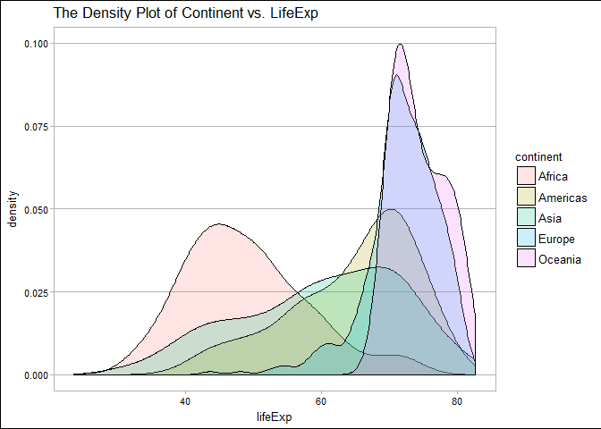
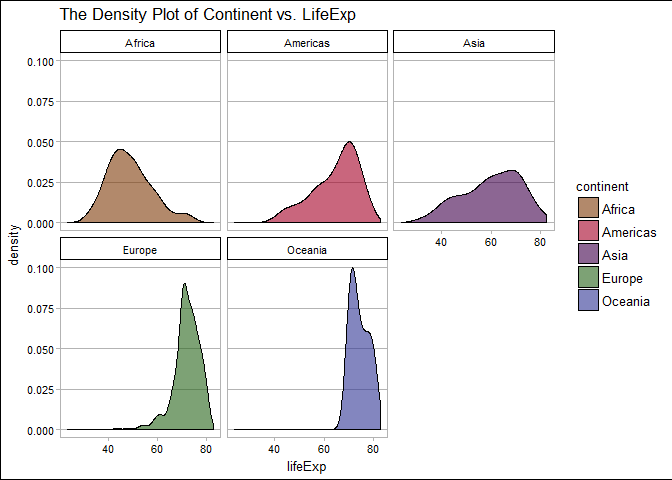
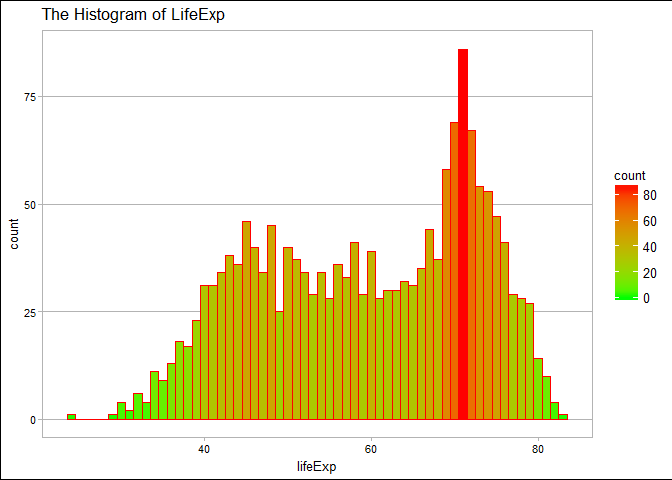
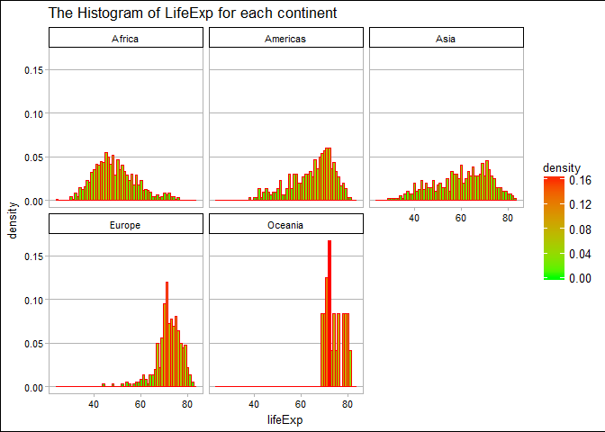

STAT545 HW05
================
Xinmiao Wang
2017-10-19

Navigation
==========

-   The main repo for homework: [here](https://github.com/xinmiaow/STAT545-hw-Wang-Xinmiao)

-   Requirement for Homework 05: click [here](http://stat545.com/hw05_factor-figure-boss-repo-hygiene.html)

-   hw05 folder: [here](https://github.com/xinmiaow/STAT545-hw-Wang-Xinmiao/tree/master/hw05).

-   Files inside hw05:

1.  [README.md](https://github.com/xinmiaow/STAT545-hw-Wang-Xinmiao/blob/master/hw05/README.md)
2.  [hw05\_Gapminder.Rmd](https://github.com/xinmiaow/STAT545-hw-Wang-Xinmiao/blob/master/hw05/hw05_Gapminder.Rmd)
3.  [hw05\_Gapminder.md](https://github.com/xinmiaow/STAT545-hw-Wang-Xinmiao/blob/master/hw05/hw05_Gapminder.md)

Induction
=========

In this Homework, we still work on Gapminder dataset, and are going to manage the factors and the figure for this dataset. Before we move to the exploration, we are going to load all the packages we need.

Load Package
============

Here, we load packages that we gonna use later.

``` r
#load packages
library(tidyverse)
```

    ## Loading tidyverse: ggplot2
    ## Loading tidyverse: tibble
    ## Loading tidyverse: tidyr
    ## Loading tidyverse: readr
    ## Loading tidyverse: purrr
    ## Loading tidyverse: dplyr

    ## Conflicts with tidy packages ----------------------------------------------

    ## filter(): dplyr, stats
    ## lag():    dplyr, stats

``` r
library(gapminder)
library(devtools)
library(forcats)
library(ggthemes)
library(grid)
```

Factor Management
=================

Drop Oceania
------------

Here, I drop all the observations in Oceania and create a new dataset called `my_dat`. By `levels(my_dat_continent)`, I found there is still five levels in total which means Oceania still is one of levels of continent. I use `droplevels()` to drop the level which no longer exist in the new dataset.

Hence, when we filter out all the observations in a category, the levels will not change automatically. We have to drop the useless level by hand.

``` r
my_dat <- gapminder %>% 
  filter(continent != "Oceania")


levels(my_dat$continent)
```

    ## [1] "Africa"   "Americas" "Asia"     "Europe"   "Oceania"

``` r
my_dat_dropped <- my_dat %>% 
  droplevels()

levels(my_dat_dropped$continent)
```

    ## [1] "Africa"   "Americas" "Asia"     "Europe"

Reorder the levels of `conitnent`
---------------------------------

Here, I reorder the levels of continent according to the mean of gdpPercap over years in each continent.

I create a table which summarize the mean of gdpPErcap in each continent, and we can compare the reordered levels of continent with the mean of gdpPercap.

``` r
gapminder %>% 
  group_by(continent) %>% 
  summarise(mean_gdpPercap = mean(gdpPercap, na.rm=TRUE)) %>% 
  knitr::kable()
```

| continent |  mean\_gdpPercap|
|:----------|----------------:|
| Africa    |         2193.755|
| Americas  |         7136.110|
| Asia      |         7902.150|
| Europe    |        14469.476|
| Oceania   |        18621.609|

``` r
gapminder$continent %>% 
  fct_reorder(gapminder$gdpPercap, mean, .desc=TRUE) %>% 
  levels()
```

    ## [1] "Oceania"  "Europe"   "Asia"     "Americas" "Africa"

Reorder the levels of `country`
-------------------------------

Here, I reorder the levels of country accroding to the maximum populations of each country.

``` r
# Reorder the levels of country based on the maximum populations of each country 
gapminder$country %>% 
  fct_reorder(gapminder$pop, max) %>% 
  levels() %>% 
  head()
```

    ## [1] "Sao Tome and Principe" "Iceland"               "Djibouti"             
    ## [4] "Equatorial Guinea"     "Bahrain"               "Comoros"

Effects of `arrange()`
----------------------

First, I try to check the difference between arrange and reorder in tables. By the difference of two tables below, we can see that reorder will not change the order of observations in the data, but arrange will sort all the observations based on our interest.

``` r
interest_country <- c("United States", "Canada", "Mexico")

gapminder %>% 
  filter(country%in%interest_country) %>% 
  mutate(country = fct_reorder(country, lifeExp, .desc=TRUE)) %>% 
  knitr::kable()
```

| country       | continent |  year|  lifeExp|        pop|  gdpPercap|
|:--------------|:----------|-----:|--------:|----------:|----------:|
| Canada        | Americas  |  1952|   68.750|   14785584|  11367.161|
| Canada        | Americas  |  1957|   69.960|   17010154|  12489.950|
| Canada        | Americas  |  1962|   71.300|   18985849|  13462.486|
| Canada        | Americas  |  1967|   72.130|   20819767|  16076.588|
| Canada        | Americas  |  1972|   72.880|   22284500|  18970.571|
| Canada        | Americas  |  1977|   74.210|   23796400|  22090.883|
| Canada        | Americas  |  1982|   75.760|   25201900|  22898.792|
| Canada        | Americas  |  1987|   76.860|   26549700|  26626.515|
| Canada        | Americas  |  1992|   77.950|   28523502|  26342.884|
| Canada        | Americas  |  1997|   78.610|   30305843|  28954.926|
| Canada        | Americas  |  2002|   79.770|   31902268|  33328.965|
| Canada        | Americas  |  2007|   80.653|   33390141|  36319.235|
| Mexico        | Americas  |  1952|   50.789|   30144317|   3478.126|
| Mexico        | Americas  |  1957|   55.190|   35015548|   4131.547|
| Mexico        | Americas  |  1962|   58.299|   41121485|   4581.609|
| Mexico        | Americas  |  1967|   60.110|   47995559|   5754.734|
| Mexico        | Americas  |  1972|   62.361|   55984294|   6809.407|
| Mexico        | Americas  |  1977|   65.032|   63759976|   7674.929|
| Mexico        | Americas  |  1982|   67.405|   71640904|   9611.148|
| Mexico        | Americas  |  1987|   69.498|   80122492|   8688.156|
| Mexico        | Americas  |  1992|   71.455|   88111030|   9472.384|
| Mexico        | Americas  |  1997|   73.670|   95895146|   9767.298|
| Mexico        | Americas  |  2002|   74.902|  102479927|  10742.441|
| Mexico        | Americas  |  2007|   76.195|  108700891|  11977.575|
| United States | Americas  |  1952|   68.440|  157553000|  13990.482|
| United States | Americas  |  1957|   69.490|  171984000|  14847.127|
| United States | Americas  |  1962|   70.210|  186538000|  16173.146|
| United States | Americas  |  1967|   70.760|  198712000|  19530.366|
| United States | Americas  |  1972|   71.340|  209896000|  21806.036|
| United States | Americas  |  1977|   73.380|  220239000|  24072.632|
| United States | Americas  |  1982|   74.650|  232187835|  25009.559|
| United States | Americas  |  1987|   75.020|  242803533|  29884.350|
| United States | Americas  |  1992|   76.090|  256894189|  32003.932|
| United States | Americas  |  1997|   76.810|  272911760|  35767.433|
| United States | Americas  |  2002|   77.310|  287675526|  39097.100|
| United States | Americas  |  2007|   78.242|  301139947|  42951.653|

``` r
gapminder %>% 
  filter(country%in%interest_country) %>%
  group_by(country) %>% 
  arrange(desc(lifeExp)) %>% 
  knitr::kable()
```

| country       | continent |  year|  lifeExp|        pop|  gdpPercap|
|:--------------|:----------|-----:|--------:|----------:|----------:|
| Canada        | Americas  |  2007|   80.653|   33390141|  36319.235|
| Canada        | Americas  |  2002|   79.770|   31902268|  33328.965|
| Canada        | Americas  |  1997|   78.610|   30305843|  28954.926|
| United States | Americas  |  2007|   78.242|  301139947|  42951.653|
| Canada        | Americas  |  1992|   77.950|   28523502|  26342.884|
| United States | Americas  |  2002|   77.310|  287675526|  39097.100|
| Canada        | Americas  |  1987|   76.860|   26549700|  26626.515|
| United States | Americas  |  1997|   76.810|  272911760|  35767.433|
| Mexico        | Americas  |  2007|   76.195|  108700891|  11977.575|
| United States | Americas  |  1992|   76.090|  256894189|  32003.932|
| Canada        | Americas  |  1982|   75.760|   25201900|  22898.792|
| United States | Americas  |  1987|   75.020|  242803533|  29884.350|
| Mexico        | Americas  |  2002|   74.902|  102479927|  10742.441|
| United States | Americas  |  1982|   74.650|  232187835|  25009.559|
| Canada        | Americas  |  1977|   74.210|   23796400|  22090.883|
| Mexico        | Americas  |  1997|   73.670|   95895146|   9767.298|
| United States | Americas  |  1977|   73.380|  220239000|  24072.632|
| Canada        | Americas  |  1972|   72.880|   22284500|  18970.571|
| Canada        | Americas  |  1967|   72.130|   20819767|  16076.588|
| Mexico        | Americas  |  1992|   71.455|   88111030|   9472.384|
| United States | Americas  |  1972|   71.340|  209896000|  21806.036|
| Canada        | Americas  |  1962|   71.300|   18985849|  13462.486|
| United States | Americas  |  1967|   70.760|  198712000|  19530.366|
| United States | Americas  |  1962|   70.210|  186538000|  16173.146|
| Canada        | Americas  |  1957|   69.960|   17010154|  12489.950|
| Mexico        | Americas  |  1987|   69.498|   80122492|   8688.156|
| United States | Americas  |  1957|   69.490|  171984000|  14847.127|
| Canada        | Americas  |  1952|   68.750|   14785584|  11367.161|
| United States | Americas  |  1952|   68.440|  157553000|  13990.482|
| Mexico        | Americas  |  1982|   67.405|   71640904|   9611.148|
| Mexico        | Americas  |  1977|   65.032|   63759976|   7674.929|
| Mexico        | Americas  |  1972|   62.361|   55984294|   6809.407|
| Mexico        | Americas  |  1967|   60.110|   47995559|   5754.734|
| Mexico        | Americas  |  1962|   58.299|   41121485|   4581.609|
| Mexico        | Americas  |  1957|   55.190|   35015548|   4131.547|
| Mexico        | Americas  |  1952|   50.789|   30144317|   3478.126|

Secondly, I try to figure out the different effects between these two functions in figures. I create three plots, the first one created by using the original data, the second one created by reordered data, and the last one created after arranging the data.

By the change of colors for the three countries, we can see that the effect of reorder works on plot, but the arrange does not change the plot.

``` r
p1 <- gapminder %>%
  filter(country%in%interest_country) %>% 
  ggplot(aes(x=year, y=lifeExp, color=country))+
  geom_line()+
  geom_point()+
  theme_calc()+
  ggtitle("The Plot of LifeExp over years")

p2 <- gapminder %>% 
  filter(country%in%interest_country) %>% 
  mutate(country = fct_reorder(country, lifeExp,.desc=TRUE)) %>% 
  ggplot(aes(x=year, y=lifeExp, color=country))+
  geom_line()+
  geom_point()+
  theme_calc()+
  ggtitle("The Plot of LifeExp over years (reoder)")

p3 <- gapminder %>% 
  filter(country%in%interest_country) %>% 
  arrange(desc(lifeExp)) %>% 
  ggplot(aes(x=year, y=lifeExp, color=country))+
  geom_line()+
  geom_point()+
  theme_calc()+
  ggtitle("The Plot of LifeExp over years (arrange)")

multiplot(p1, p2, p3, cols=3)
```


File I/O
========

Here, I reorder the levels of country and crest a new dataset. I save it locally in two different way.

First, I write it into a .csv file by `write_csv`, and then read it by `read_csv`. And then, I use `saveRDS` to save the dataset as a .rds file.

By `write_csv`, the reordered levels of country were not saved. However, `saveRDS` can do so.

``` r
gap_re_country <- gapminder %>% 
  mutate(country=fct_reorder(country, pop, max) )


write_csv(gap_re_country, "gap_re_country.csv")

temp <- read_csv("gap_re_country.csv")
```

    ## Parsed with column specification:
    ## cols(
    ##   country = col_character(),
    ##   continent = col_character(),
    ##   year = col_integer(),
    ##   lifeExp = col_double(),
    ##   pop = col_integer(),
    ##   gdpPercap = col_double()
    ## )

``` r
temp %>% 
  head() %>% 
  knitr::kable()
```

| country     | continent |  year|  lifeExp|       pop|  gdpPercap|
|:------------|:----------|-----:|--------:|---------:|----------:|
| Afghanistan | Asia      |  1952|   28.801|   8425333|   779.4453|
| Afghanistan | Asia      |  1957|   30.332|   9240934|   820.8530|
| Afghanistan | Asia      |  1962|   31.997|  10267083|   853.1007|
| Afghanistan | Asia      |  1967|   34.020|  11537966|   836.1971|
| Afghanistan | Asia      |  1972|   36.088|  13079460|   739.9811|
| Afghanistan | Asia      |  1977|   38.438|  14880372|   786.1134|

``` r
head(levels(as.factor(temp$country)))
```

    ## [1] "Afghanistan" "Albania"     "Algeria"     "Angola"      "Argentina"  
    ## [6] "Australia"

``` r
saveRDS(gap_re_country, "gap_re_country.rds")

temp2 <- readRDS("gap_re_country.rds")

temp2 %>% 
  head() %>% 
  knitr::kable()
```

| country     | continent |  year|  lifeExp|       pop|  gdpPercap|
|:------------|:----------|-----:|--------:|---------:|----------:|
| Afghanistan | Asia      |  1952|   28.801|   8425333|   779.4453|
| Afghanistan | Asia      |  1957|   30.332|   9240934|   820.8530|
| Afghanistan | Asia      |  1962|   31.997|  10267083|   853.1007|
| Afghanistan | Asia      |  1967|   34.020|  11537966|   836.1971|
| Afghanistan | Asia      |  1972|   36.088|  13079460|   739.9811|
| Afghanistan | Asia      |  1977|   38.438|  14880372|   786.1134|

``` r
head(levels(temp2$country))
```

    ## [1] "Sao Tome and Principe" "Iceland"               "Djibouti"             
    ## [4] "Equatorial Guinea"     "Bahrain"               "Comoros"

Visualization Design
====================

Here is a density plot of lifeExp in each continent I created in HW02. The color changed when the densities overlap. Hence, I separate them into five plots and use `scale_fill_manual()` to fill continent color into the densities.

``` r
ggplot(gapminder, aes(x = lifeExp, fill = continent)) +
  geom_density(alpha = 0.2, lwd=0.65)+
  theme_calc()+
  ggtitle("The Density Plot of Continent vs. LifeExp")
```



``` r
ggplot(gapminder, aes(x=lifeExp, fill=continent))+
  geom_density(alpha=0.6, lwd=0.65)+
  facet_wrap(~continent)+
  scale_fill_manual(values=continent_colors)+
  theme_calc()+
  ggtitle("The Density Plot of Continent vs. LifeExp")
```



Here is the histogram of lifeExp I created in HW02. To make it clear, I also separate them into five plots according the continents, and use `..density..` to translate the count to the percentage.

``` r
ggplot(gapminder, aes(x=lifeExp))+
  geom_histogram(binwidth = 1,col="red", aes(fill=..count..))+
  scale_fill_gradient("count", low = "green", high = "red")+
  theme_calc()+
  ggtitle("The Histogram of LifeExp")
```



``` r
ggplot(gapminder, aes(x=lifeExp))+
  geom_histogram(binwidth = 1,col="red", aes(y=..density.., fill=..density..))+
  scale_fill_gradient("density", low = "green", high = "red")+
  facet_wrap(~continent)+
  theme_calc()+
  ggtitle("The Histogram of LifeExp for each continent")
```



Writing Figures to File
=======================

Here is The plot of lifeExp vs. gdpPercap in 2007. I adjust the sie of points by the population in each country.

``` r
p <- gapminder %>% 
  filter(year==2007, continent!="Oceania") %>% 
  ggplot(aes(x=gdpPercap, y=lifeExp))+
  geom_point(aes(size=pop, fill=country), pch=21, show.legend = F)+
  scale_size_continuous(range = c(1,40))+
  scale_x_log10(limits = c(230, 63000))+
  ylim(c(39, 100))+
  facet_wrap(~continent)+
  scale_fill_manual(values = country_colors)+
  theme_calc()+
  ggtitle("The Plot of LifeExp vs. gdpPercap in 2007 (adjust point size by pop)")

ggsave("img.png", plot=p)
```

    ## Saving 7 x 5 in image

Display the figure we saved.


Clean up your repo
==================

check the table in the main README.md

Revalue a Factor
================

Here, I create a new factor called food, and map the levels of country into food.

``` r
gap_new <- gapminder %>% 
  filter(country%in%interest_country) %>% 
  mutate(food=fct_recode(country, "Tim Hortons"="Canada", "Starbuck"="United States", "Taco"="Mexico")) %>% 
  droplevels()

knitr::kable(gap_new)
```

| country       | continent |  year|  lifeExp|        pop|  gdpPercap| food        |
|:--------------|:----------|-----:|--------:|----------:|----------:|:------------|
| Canada        | Americas  |  1952|   68.750|   14785584|  11367.161| Tim Hortons |
| Canada        | Americas  |  1957|   69.960|   17010154|  12489.950| Tim Hortons |
| Canada        | Americas  |  1962|   71.300|   18985849|  13462.486| Tim Hortons |
| Canada        | Americas  |  1967|   72.130|   20819767|  16076.588| Tim Hortons |
| Canada        | Americas  |  1972|   72.880|   22284500|  18970.571| Tim Hortons |
| Canada        | Americas  |  1977|   74.210|   23796400|  22090.883| Tim Hortons |
| Canada        | Americas  |  1982|   75.760|   25201900|  22898.792| Tim Hortons |
| Canada        | Americas  |  1987|   76.860|   26549700|  26626.515| Tim Hortons |
| Canada        | Americas  |  1992|   77.950|   28523502|  26342.884| Tim Hortons |
| Canada        | Americas  |  1997|   78.610|   30305843|  28954.926| Tim Hortons |
| Canada        | Americas  |  2002|   79.770|   31902268|  33328.965| Tim Hortons |
| Canada        | Americas  |  2007|   80.653|   33390141|  36319.235| Tim Hortons |
| Mexico        | Americas  |  1952|   50.789|   30144317|   3478.126| Taco        |
| Mexico        | Americas  |  1957|   55.190|   35015548|   4131.547| Taco        |
| Mexico        | Americas  |  1962|   58.299|   41121485|   4581.609| Taco        |
| Mexico        | Americas  |  1967|   60.110|   47995559|   5754.734| Taco        |
| Mexico        | Americas  |  1972|   62.361|   55984294|   6809.407| Taco        |
| Mexico        | Americas  |  1977|   65.032|   63759976|   7674.929| Taco        |
| Mexico        | Americas  |  1982|   67.405|   71640904|   9611.148| Taco        |
| Mexico        | Americas  |  1987|   69.498|   80122492|   8688.156| Taco        |
| Mexico        | Americas  |  1992|   71.455|   88111030|   9472.384| Taco        |
| Mexico        | Americas  |  1997|   73.670|   95895146|   9767.298| Taco        |
| Mexico        | Americas  |  2002|   74.902|  102479927|  10742.441| Taco        |
| Mexico        | Americas  |  2007|   76.195|  108700891|  11977.575| Taco        |
| United States | Americas  |  1952|   68.440|  157553000|  13990.482| Starbuck    |
| United States | Americas  |  1957|   69.490|  171984000|  14847.127| Starbuck    |
| United States | Americas  |  1962|   70.210|  186538000|  16173.146| Starbuck    |
| United States | Americas  |  1967|   70.760|  198712000|  19530.366| Starbuck    |
| United States | Americas  |  1972|   71.340|  209896000|  21806.036| Starbuck    |
| United States | Americas  |  1977|   73.380|  220239000|  24072.632| Starbuck    |
| United States | Americas  |  1982|   74.650|  232187835|  25009.559| Starbuck    |
| United States | Americas  |  1987|   75.020|  242803533|  29884.350| Starbuck    |
| United States | Americas  |  1992|   76.090|  256894189|  32003.932| Starbuck    |
| United States | Americas  |  1997|   76.810|  272911760|  35767.433| Starbuck    |
| United States | Americas  |  2002|   77.310|  287675526|  39097.100| Starbuck    |
| United States | Americas  |  2007|   78.242|  301139947|  42951.653| Starbuck    |

``` r
levels(gap_new$country)
```

    ## [1] "Canada"        "Mexico"        "United States"

``` r
levels(gap_new$food)
```

    ## [1] "Tim Hortons" "Taco"        "Starbuck"

Report your Process
===================

This assignment requires a lot of creative ideas about exploring dataset. However, most of functions have been introduced in class, and some of them can be found in the notes. Overall, it's not to hard to finish it.

I spend a lot of time on organize the display of my figures and find the difference between arrange and reorder.

Reference
=========

-   [Taking control of qualitative colors in ggplot2](http://stat545.com/block019_enforce-color-scheme.html)

-   [Multiple plots on a page](http://stat545.com/block020_multiple-plots-on-a-page.html)

-   [Getting data in and out of R](http://stat545.com/block026_file-out-in.html)
