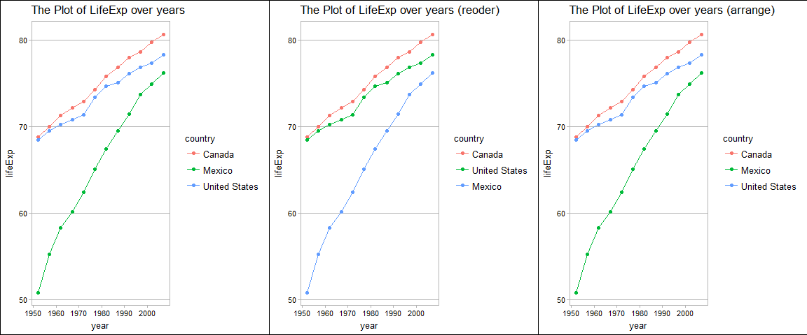

STAT545 HW05
================
Xinmiao Wang
2017-10-18

Navigation
==========

-   The main repo for homework: [here](https://github.com/xinmiaow/STAT545-hw-Wang-Xinmiao)

-   Requirement for Homework 05: click [here](http://stat545.com/hw05_factor-figure-boss-repo-hygiene.html)

-   hw05 folder: [here](https://github.com/xinmiaow/STAT545-hw-Wang-Xinmiao/tree/master/hw05).

-   Files inside hw05:

1.  [README.md](https://github.com/xinmiaow/STAT545-hw-Wang-Xinmiao/blob/master/hw05/README.md)
2.  \[hw05\_Gapminder.Rmd\]
3.  \[hw05\_Gapminder.md\]

Induction
=========

In this Homework, we still work on Gapminder dataset, and are going to manage the factors and the figure for this dataset. Before we move to the exploration, we are going to load all the packages we need.

Load Package
============

Here, we load packages that we gonna use later.

``` r
#load packages
library(tidyverse)
```

    ## Loading tidyverse: ggplot2
    ## Loading tidyverse: tibble
    ## Loading tidyverse: tidyr
    ## Loading tidyverse: readr
    ## Loading tidyverse: purrr
    ## Loading tidyverse: dplyr

    ## Conflicts with tidy packages ----------------------------------------------

    ## filter(): dplyr, stats
    ## lag():    dplyr, stats

``` r
library(gapminder)
library(devtools)
library(forcats)
library(ggthemes)
```

Factor Management
=================

Drop Oceania
------------

``` r
my_dat <- gapminder %>% 
  filter(continent != "Oceania")


levels(my_dat$continent)
```

    ## [1] "Africa"   "Americas" "Asia"     "Europe"   "Oceania"

``` r
my_dat_dropped <- my_dat %>% 
  droplevels()

levels(my_dat_dropped$continent)
```

    ## [1] "Africa"   "Americas" "Asia"     "Europe"

Reorder the levels of `conitnent`
---------------------------------

``` r
gapminder %>% 
  group_by(continent) %>% 
  summarise(mean_gdpPercap = mean(gdpPercap, na.rm=TRUE)) %>% 
  knitr::kable()
```

| continent |  mean\_gdpPercap|
|:----------|----------------:|
| Africa    |         2193.755|
| Americas  |         7136.110|
| Asia      |         7902.150|
| Europe    |        14469.476|
| Oceania   |        18621.609|

``` r
gapminder %>% 
  mutate(continent=fct_reorder(continent, gdpPercap, mean, .desc=TRUE) ) %>% 
  group_by(continent) %>% 
  summarise(mean_gdpPercap = mean(gdpPercap, na.rm=TRUE)) %>% 
  knitr::kable()
```

| continent |  mean\_gdpPercap|
|:----------|----------------:|
| Oceania   |        18621.609|
| Europe    |        14469.476|
| Asia      |         7902.150|
| Americas  |         7136.110|
| Africa    |         2193.755|

Reorder the levels of `country`
-------------------------------

``` r
# Reorder the levels of country based on the maximum populations of each country 
gapminder$country %>% 
  fct_reorder(gapminder$pop, max) %>% 
  levels() %>% 
  head()
```

    ## [1] "Sao Tome and Principe" "Iceland"               "Djibouti"             
    ## [4] "Equatorial Guinea"     "Bahrain"               "Comoros"

Effects of `arrange()`
----------------------

``` r
gap_asia_2007 <- gapminder %>% filter(year == 2007, continent == "Asia")

ggplot(gap_asia_2007, aes(x = pop, y = country)) + geom_point()
```



``` r
gap_asia_2007 %>% 
  ggplot(aes(x = pop, y = fct_reorder(country, pop, max))) +
  geom_point()
```


``` r
gap_asia_2007 %>% 
  arrange(country, desc(pop)) %>% 
  ggplot(aes(x = pop, y =country)) +
  geom_point()
```


``` r
gap_asia_2007 %>% 
  mutate(country = fct_reorder(country, pop, max)) %>% 
  arrange(country, desc(pop)) %>% 
  ggplot(aes(x = pop, y =country)) +
  geom_point()
```


``` r
gap_asia_2007_reorder <- gap_asia_2007 %>% 
  mutate(country = fct_reorder(country, pop, max))

levels(gap_asia_2007_reorder$country)
```

    ##   [1] "Bahrain"                  "Kuwait"                  
    ##   [3] "Mongolia"                 "Oman"                    
    ##   [5] "Lebanon"                  "West Bank and Gaza"      
    ##   [7] "Singapore"                "Jordan"                  
    ##   [9] "Israel"                   "Hong Kong, China"        
    ##  [11] "Cambodia"                 "Syria"                   
    ##  [13] "Sri Lanka"                "Yemen, Rep."             
    ##  [15] "Taiwan"                   "Korea, Dem. Rep."        
    ##  [17] "Malaysia"                 "Iraq"                    
    ##  [19] "Saudi Arabia"             "Nepal"                   
    ##  [21] "Afghanistan"              "Myanmar"                 
    ##  [23] "Korea, Rep."              "Thailand"                
    ##  [25] "Iran"                     "Vietnam"                 
    ##  [27] "Philippines"              "Japan"                   
    ##  [29] "Bangladesh"               "Pakistan"                
    ##  [31] "Indonesia"                "India"                   
    ##  [33] "China"                    "Albania"                 
    ##  [35] "Algeria"                  "Angola"                  
    ##  [37] "Argentina"                "Australia"               
    ##  [39] "Austria"                  "Belgium"                 
    ##  [41] "Benin"                    "Bolivia"                 
    ##  [43] "Bosnia and Herzegovina"   "Botswana"                
    ##  [45] "Brazil"                   "Bulgaria"                
    ##  [47] "Burkina Faso"             "Burundi"                 
    ##  [49] "Cameroon"                 "Canada"                  
    ##  [51] "Central African Republic" "Chad"                    
    ##  [53] "Chile"                    "Colombia"                
    ##  [55] "Comoros"                  "Congo, Dem. Rep."        
    ##  [57] "Congo, Rep."              "Costa Rica"              
    ##  [59] "Cote d'Ivoire"            "Croatia"                 
    ##  [61] "Cuba"                     "Czech Republic"          
    ##  [63] "Denmark"                  "Djibouti"                
    ##  [65] "Dominican Republic"       "Ecuador"                 
    ##  [67] "Egypt"                    "El Salvador"             
    ##  [69] "Equatorial Guinea"        "Eritrea"                 
    ##  [71] "Ethiopia"                 "Finland"                 
    ##  [73] "France"                   "Gabon"                   
    ##  [75] "Gambia"                   "Germany"                 
    ##  [77] "Ghana"                    "Greece"                  
    ##  [79] "Guatemala"                "Guinea"                  
    ##  [81] "Guinea-Bissau"            "Haiti"                   
    ##  [83] "Honduras"                 "Hungary"                 
    ##  [85] "Iceland"                  "Ireland"                 
    ##  [87] "Italy"                    "Jamaica"                 
    ##  [89] "Kenya"                    "Lesotho"                 
    ##  [91] "Liberia"                  "Libya"                   
    ##  [93] "Madagascar"               "Malawi"                  
    ##  [95] "Mali"                     "Mauritania"              
    ##  [97] "Mauritius"                "Mexico"                  
    ##  [99] "Montenegro"               "Morocco"                 
    ## [101] "Mozambique"               "Namibia"                 
    ## [103] "Netherlands"              "New Zealand"             
    ## [105] "Nicaragua"                "Niger"                   
    ## [107] "Nigeria"                  "Norway"                  
    ## [109] "Panama"                   "Paraguay"                
    ## [111] "Peru"                     "Poland"                  
    ## [113] "Portugal"                 "Puerto Rico"             
    ## [115] "Reunion"                  "Romania"                 
    ## [117] "Rwanda"                   "Sao Tome and Principe"   
    ## [119] "Senegal"                  "Serbia"                  
    ## [121] "Sierra Leone"             "Slovak Republic"         
    ## [123] "Slovenia"                 "Somalia"                 
    ## [125] "South Africa"             "Spain"                   
    ## [127] "Sudan"                    "Swaziland"               
    ## [129] "Sweden"                   "Switzerland"             
    ## [131] "Tanzania"                 "Togo"                    
    ## [133] "Trinidad and Tobago"      "Tunisia"                 
    ## [135] "Turkey"                   "Uganda"                  
    ## [137] "United Kingdom"           "United States"           
    ## [139] "Uruguay"                  "Venezuela"               
    ## [141] "Zambia"                   "Zimbabwe"

File I/O
========

``` r
gap_re_country <- gapminder %>% 
  mutate(country=fct_reorder(country, pop, max) ) %>% 
  group_by(country) %>% 
  summarise(max_pop = max(pop))


write_csv(gap_re_country, "gap_re_country.csv")

temp <- read.csv("gap_re_country.csv")

temp %>% 
  head() %>% 
  knitr::kable()
```

| country               |  max\_pop|
|:----------------------|---------:|
| Sao Tome and Principe |    199579|
| Iceland               |    301931|
| Djibouti              |    496374|
| Equatorial Guinea     |    551201|
| Bahrain               |    708573|
| Comoros               |    710960|

Visualization Design
====================

Writing Figures to File
=======================

``` r
p <- gapminder %>% 
  filter(year==2007, continent!="Oceania") %>% 
  ggplot(aes(x=gdpPercap, y=lifeExp))+
  geom_point(aes(size=pop, fill=country), pch=21, show.legend = F)+
  scale_size_continuous(range = c(1,40))+
  scale_x_log10(limits = c(230, 63000))+
  ylim(c(39, 100))+
  facet_wrap(~continent)+
  scale_fill_manual(values = country_colors)

ggsave("img.png", plot=p)
```

    ## Saving 7 x 5 in image

Display the figure we saved.


Clean up your repo
==================

Revalue a Factor
================

Report your Process
===================

Reference
=========

-   [Taking control of qualitative colors in ggplot2](http://stat545.com/block019_enforce-color-scheme.html)
