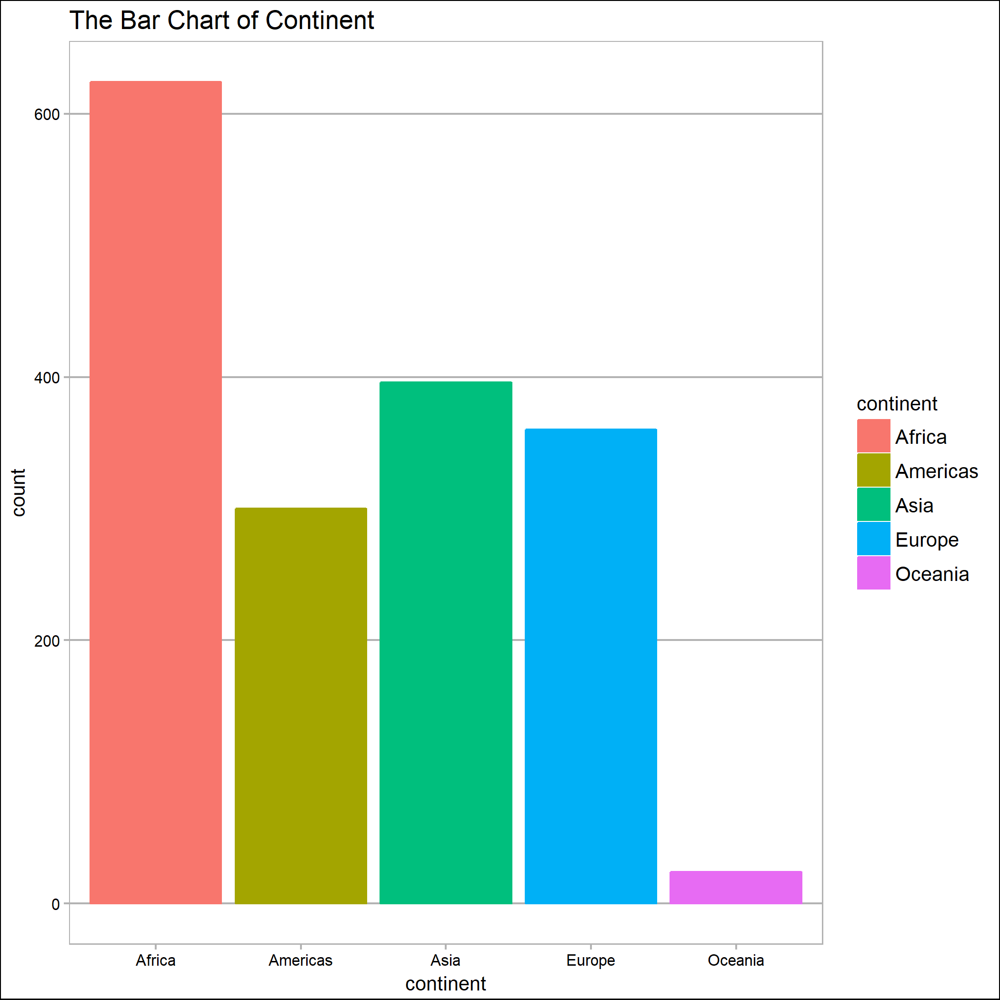
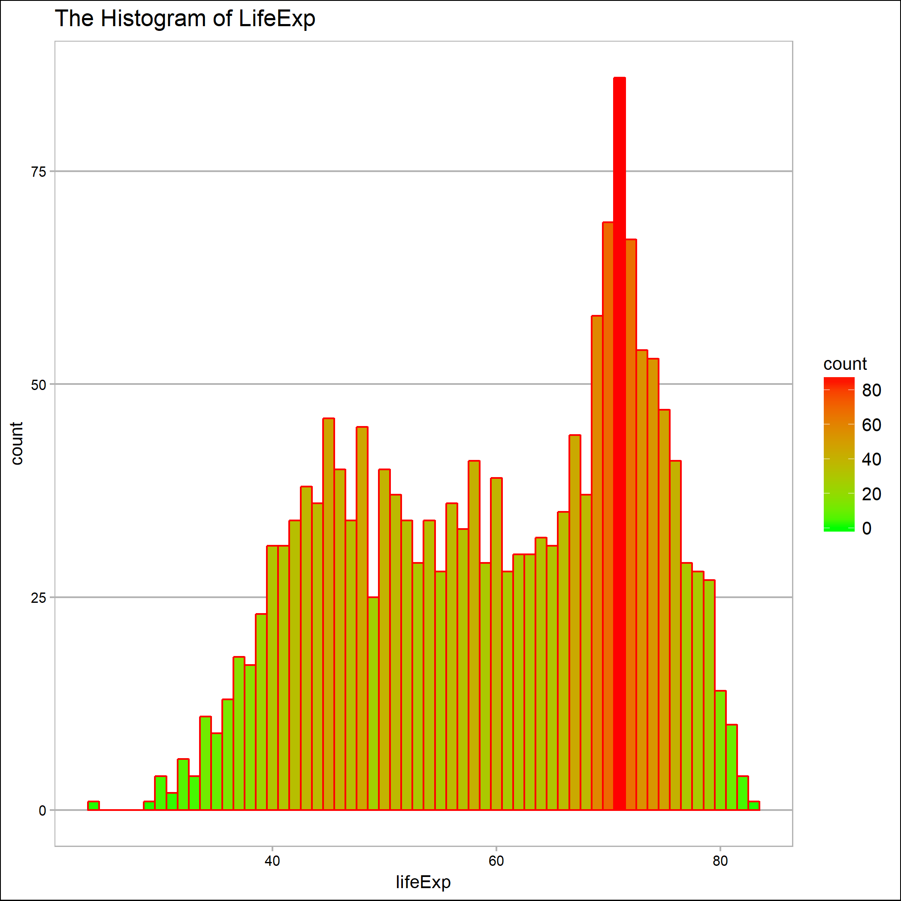
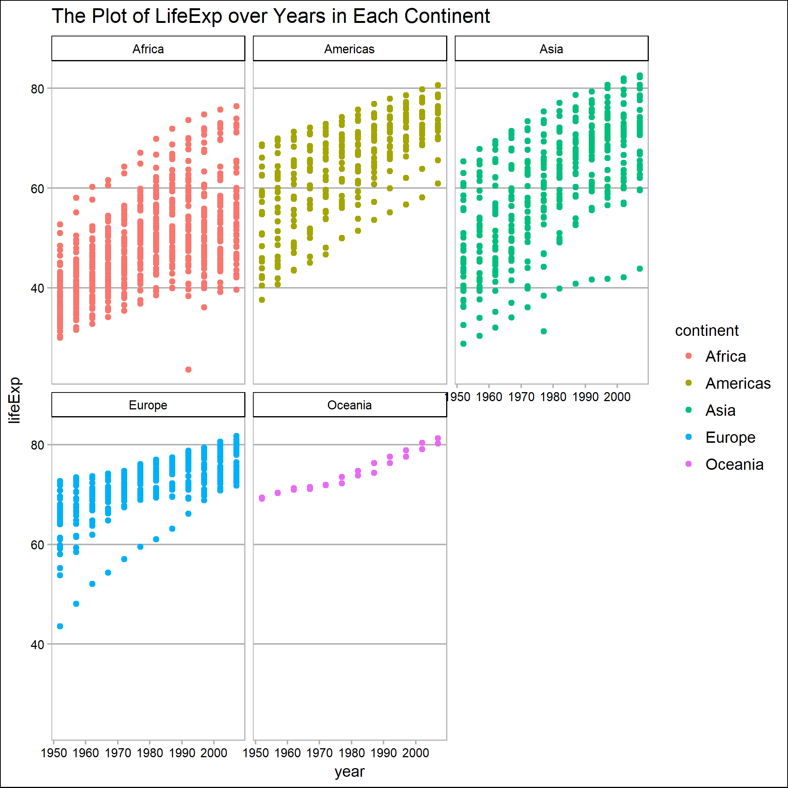
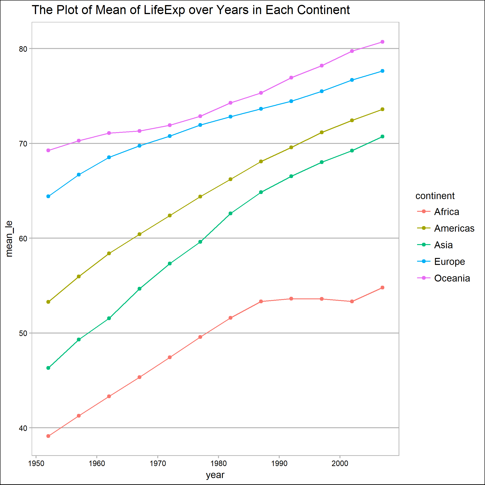
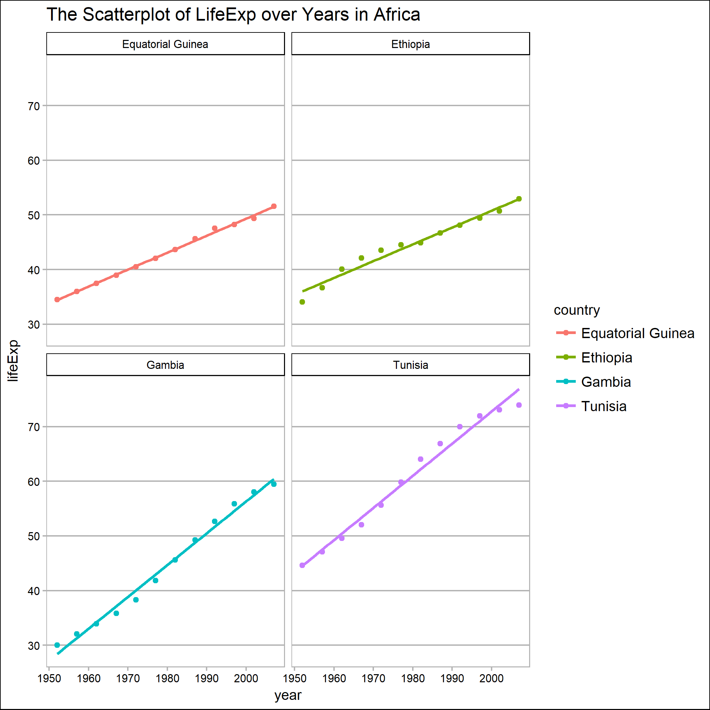
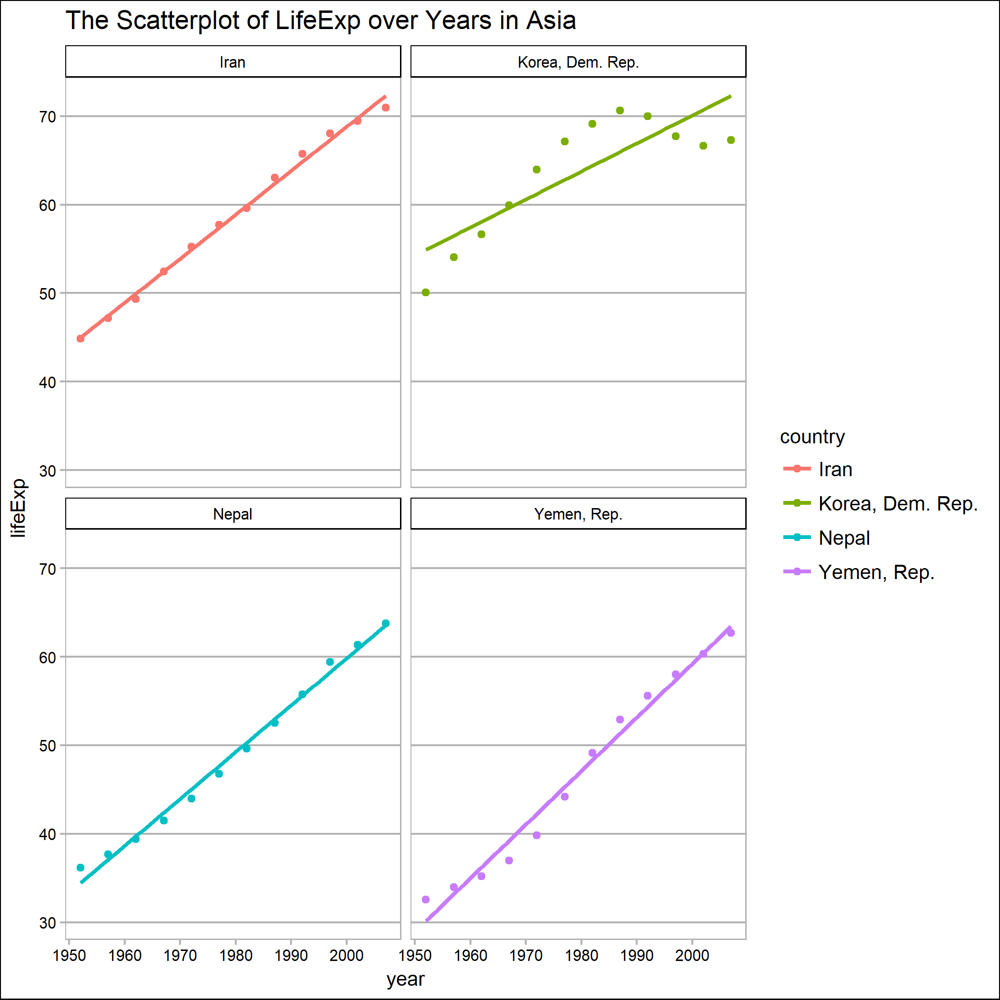
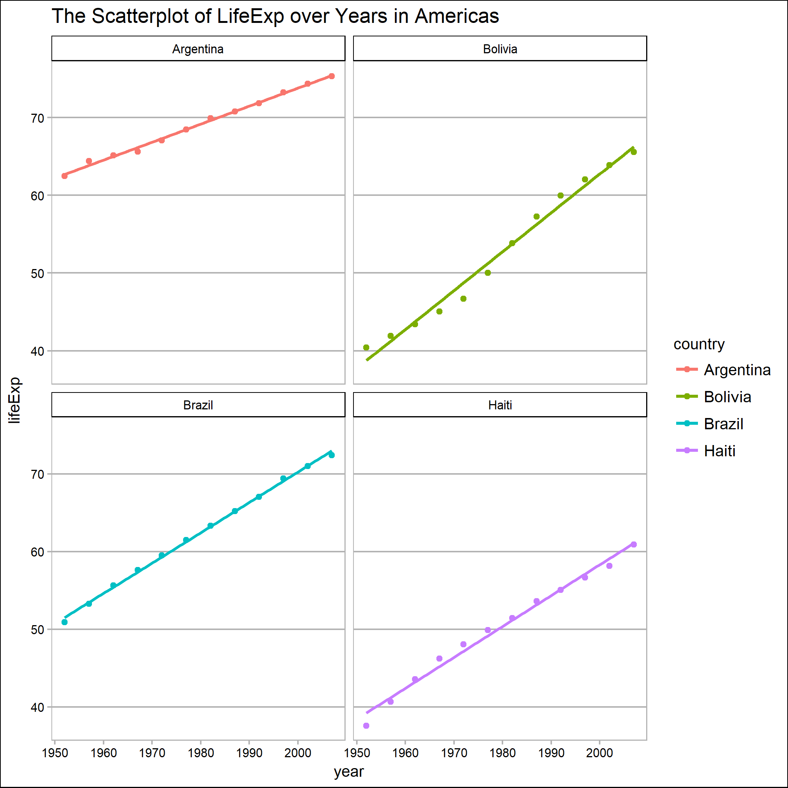
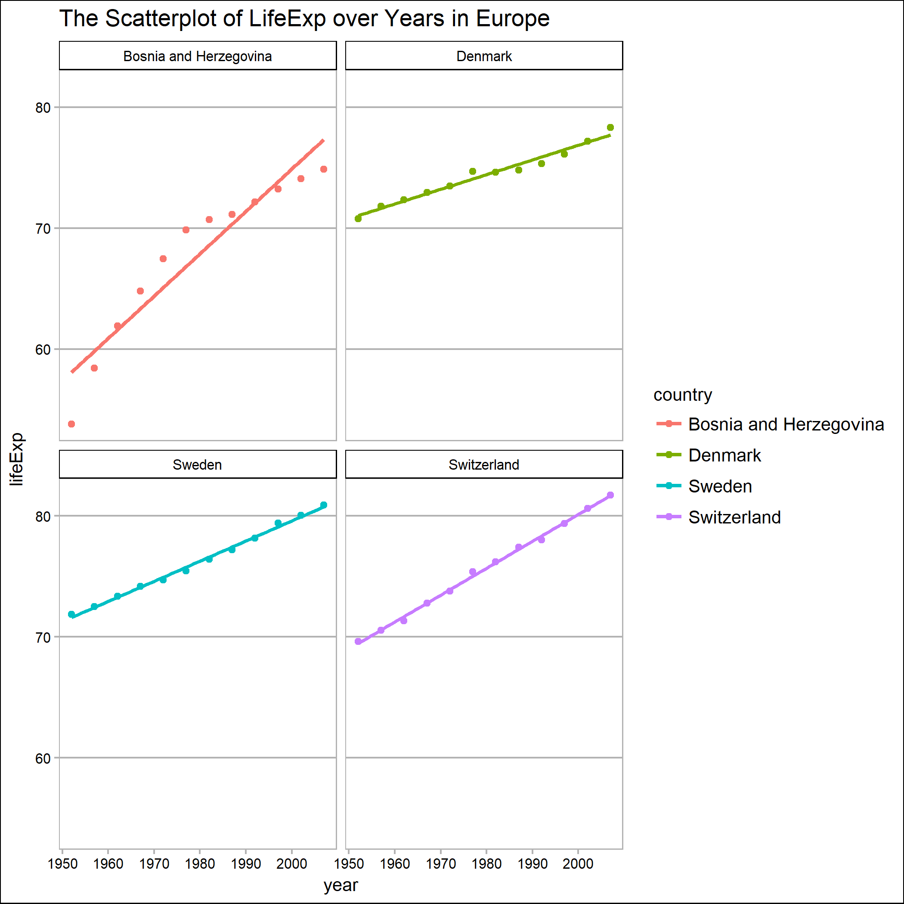
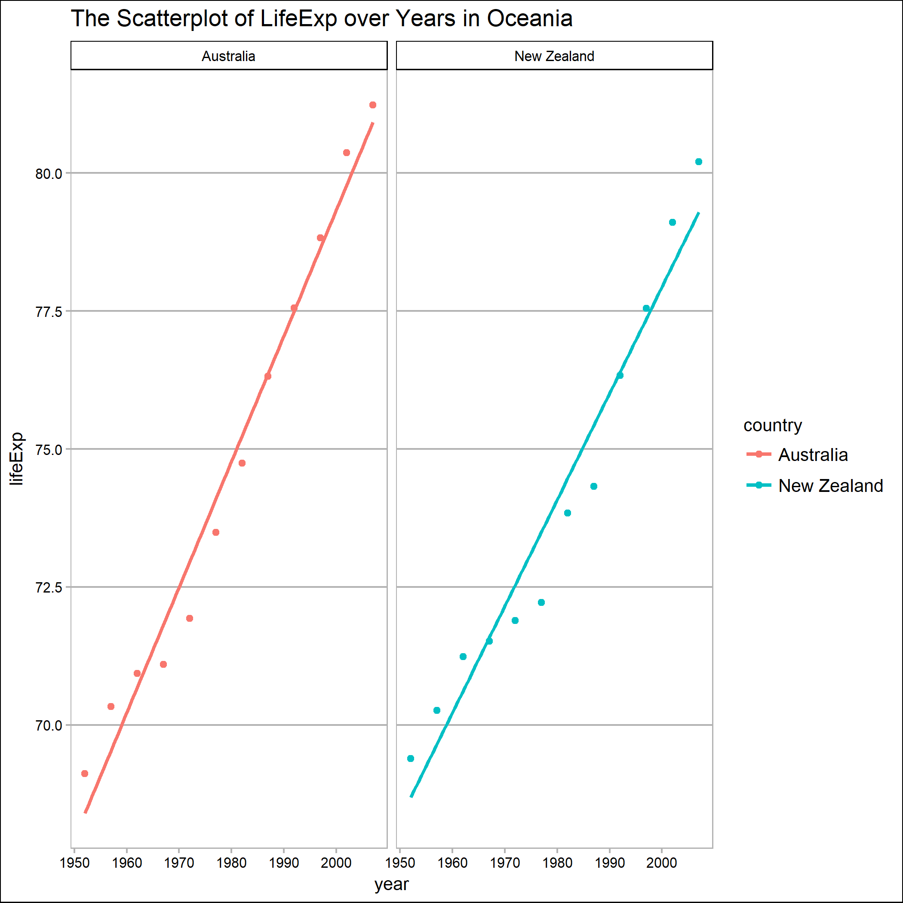

# Introduction

In this assignment, we practice to automate the data-analysis pipeline. 
First, we create Write some R scripts to carry out a small data analysis. The output of the first script must be the input of the second, and so on. After doing so, we write a Makefile to pipeline these R scripts together, and get the result of data analysis.

# Download the data

First, I download the dataset, `gapminder` online, and save as `gapminder.tsv`.
Let's read the dataset and have a look at it

```{r load_data}
gapminder <- read.delim("gapminder.tsv")

str(gapminder)
```


# Perform exploratory analyses

I an interested in the change of Life Expectancy over time. Hence, here I explore the visualization of continent, lifeExp.

Here is the bar chart of continent. 
There are six continents where we collected data, including Africa, Americas, Asia, Europe and Oceania.



Here is the Histogram of lifeExp.



To explore the change of lifeExp over time for each continent, I create the following figure. We can see the increasing trend of LifeExp in each continent.



To compare the LifeExp among continent, I plot the mean of LifeExp over years for each continent. We can see the life expectancy of Oceania is always larger than other continents and there is no crossover among each lines



Based on the figure above, I am going to reorder the level of continents by the average of lifeExp in each continent. 

```{r reorder_daat}
gap_re_continent <- readRDS("gap_re_continent.rds")

levels(gap_re_continent$continent)
```


# Perform statistical analyses

After reordering continent, I saved it in the first R script and read it in the second R script. 

In this section, I want to fit a linear regression model for LifeExp in each country. I create a function, called `lm_ly`, which fits a linear model for lifeExp and year and return the coefficients and residual standard error. 

Based on the residual standard error, I choose four countries in continent, whose residual standard error are small, as the four best countries, and four worst countries with lager residual standard error.

Here, I display four best countries in each continent.
```{r }
gap_bfit <- read.delim("gap_bfit.tsv")

gap_bfit %>%
  group_by(continent, country)
  summarise(mean_lifeExp = mean(lifeExp)) %>% 
  arrange(desc(mean_lifeExp)) %>% 
  knitr::kable()

```


# Generate figures

In this section, I use the dataset created in the second R script, called `gap_bfit.tsv` to generate the scatterplot of lifeExp over year with a linear regression line for four countries in each continent.

I display them in the order of their mean lifeExp, which we used it before to reorder the levels of continent.

The Scatterplot of LifeExp over Years in Africa



The Scatterplot of LifeExp over Years in Asia



The Scatterplot of LifeExp over Years in Americas



The Scatterplot of LifeExp over Years in Europe



The Scatterplot of LifeExp over Years in Oceania




