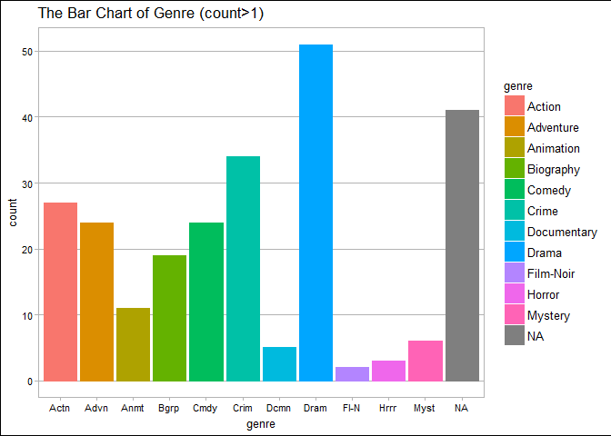
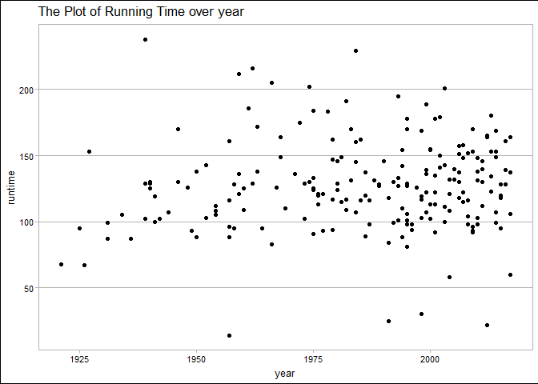

STAT545 HW10
================
Xinmiao Wang
December 3, 2017

Navigation
==========

-   The main repo for homework: [here](https://github.com/xinmiaow/STAT545-hw-Wang-Xinmiao)

-   Requirement for Homework 10: click [here](http://stat545.com/hw10_data-from-web.html)

-   hw10 folder: [here](https://github.com/xinmiaow/STAT545-hw-Wang-Xinmiao/tree/master/hw10).

-   Files inside hw10:

1.  [README.md](https://github.com/xinmiaow/STAT545-hw-Wang-Xinmiao/blob/master/hw10/README.md)
2.  [hw10\_IMDb.Rmd](https://github.com/xinmiaow/STAT545-hw-Wang-Xinmiao/blob/master/hw10/hw10_IMDb.Rmd)
3.  [hw10\_IMDb.md](https://github.com/xinmiaow/STAT545-hw-Wang-Xinmiao/blob/master/hw10/hw10_IMDb.md)

Introduction
============

In this assignment, we practice collecting data from website. Below, I collect two datasets from different sources.

1.  `topmovie`: data from [IMDb](http://www.imdb.com/?ref_=nv_home), contains 250 movies which are the top of 250 rated movies. The variables are title, rank, year and rate.

2.  `movie.info`: data from [OMDb API](http://www.omdbapi.com/), contains the information of movies whose title and year can match to the source data. The variables include title, rank, runtime, country and genre,

After that, I merge the two dataset according to the rank and do some basic explanatory analysis for some variables.

Load Package
============

``` r
library(tidyverse)
```

    ## Loading tidyverse: ggplot2
    ## Loading tidyverse: tibble
    ## Loading tidyverse: tidyr
    ## Loading tidyverse: readr
    ## Loading tidyverse: purrr
    ## Loading tidyverse: dplyr

    ## Conflicts with tidy packages ----------------------------------------------

    ## filter(): dplyr, stats
    ## lag():    dplyr, stats

``` r
library(magrittr)
```

    ## 
    ## Attaching package: 'magrittr'

    ## The following object is masked from 'package:purrr':
    ## 
    ##     set_names

    ## The following object is masked from 'package:tidyr':
    ## 
    ##     extract

``` r
library(purrr)
library(glue)
```

    ## 
    ## Attaching package: 'glue'

    ## The following object is masked from 'package:dplyr':
    ## 
    ##     collapse

``` r
library(stringr)

library(xml2)
library(rvest)
```

    ## 
    ## Attaching package: 'rvest'

    ## The following object is masked from 'package:purrr':
    ## 
    ##     pluck

    ## The following object is masked from 'package:readr':
    ## 
    ##     guess_encoding

``` r
library(httr)

library(ggthemes)
```

Read Data
=========

Read the page of Top Rated Movies: Scrape Data
----------------------------------------------

I collect the data from [IMDb:Top Rated Movies](http://www.imdb.com/chart/top?ref_=nv_mv_250_6)

``` r
url_title <- "http://www.imdb.com/chart/top?ref_=nv_mv_250_6"
page_title <- read_html(url_title)
```

### Read the title of Top Rated Movies

``` r
title <- page_title %>% 
  html_nodes(css = ".titleColumn") %>% 
  html_text()

head(title, 5)
```

    ## [1] "\n      1.\n      The Shawshank Redemption\n        (1994)\n    "
    ## [2] "\n      2.\n      The Godfather\n        (1972)\n    "           
    ## [3] "\n      3.\n      The Godfather: Part II\n        (1974)\n    "  
    ## [4] "\n      4.\n      The Dark Knight\n        (2008)\n    "         
    ## [5] "\n      5.\n      12 Angry Men\n        (1957)\n    "

As we can see above, the format of movies' titles are really messy. Each record contains the order of the movie's rank, the title of the movie and also the year in which the movie was produced. Here, I am going to write a function so that we can extract the titles and year easily.

``` r
get.title <- function(x){
  x.tmp <- str_extract_all(x, boundary(("word")))[[1]]
  n <- length(x.tmp)
  title <- str_c(x.tmp[-c(1, n)], collapse = " ")
  return(title)
}

get.year <- function(x){
  x.tmp <- str_extract_all(x, boundary(("word")))[[1]]
  n <- length(x.tmp)
  year <- as.integer(x.tmp[n])
  return(year)
}

get.rank <- function(x){
  x.tmp <- str_extract_all(x, boundary(("word")))[[1]]
  rank <- as.integer(x.tmp[1])
  return(rank)
}
```

I read the movies' titles and year by using the functions `get.title` and `get.year` above.

``` r
mytitle <- map_chr(title, get.title)

head(mytitle, 5)
```

    ## [1] "The Shawshank Redemption" "The Godfather"           
    ## [3] "The Godfather Part II"    "The Dark Knight"         
    ## [5] "12 Angry Men"

``` r
myyear <- map_int(title, get.year)

head(myyear, 5)
```

    ## [1] 1994 1972 1974 2008 1957

``` r
myrank <- map_int(title, get.rank)

head(myrank, 5)
```

    ## [1] 1 2 3 4 5

### Read the Rates of Movies

``` r
rate <- page_title %>% 
  html_nodes(css = ".imdbRating") %>% 
  html_text()

head(rate, 5)
```

    ## [1] "\n            9.2\n    " "\n            9.2\n    "
    ## [3] "\n            9.0\n    " "\n            9.0\n    "
    ## [5] "\n            8.9\n    "

Similar to the last part, the format of rate is also not easy to read. Here, I define a function so that we can extract the rate of each movie as a double.

``` r
get.rate <- function(x){
  x.tmp <- str_extract_all(x, boundary(("word")))[[1]]
  n <- length(x.tmp)
  rate <- as.double(x.tmp[n])
  return(rate)
}
```

Now, let's extract the rate. We can see it can be used and analyzed easily.

``` r
myrate <- map_dbl(rate, get.rate)

head(myrate, 5)
```

    ## [1] 9.2 9.2 9.0 9.0 8.9

### Combine Variables

After collecting all the information in this page, I am going to combine these three variables as a dataset.

``` r
topmovie <- data_frame(title=mytitle, rank=myrank, year=myyear, rate=myrate)

head(topmovie, 5)
```

    ## # A tibble: 5 x 4
    ##                      title  rank  year  rate
    ##                      <chr> <int> <int> <dbl>
    ## 1 The Shawshank Redemption     1  1994   9.2
    ## 2            The Godfather     2  1972   9.2
    ## 3    The Godfather Part II     3  1974   9.0
    ## 4          The Dark Knight     4  2008   9.0
    ## 5             12 Angry Men     5  1957   8.9

Read data for Each Movie: APIs
------------------------------

At first, I tried to extract the information of each movie from their own page. However, it is difficult to find the corresponding tag for all information I want to collect. Hence, I am going to collect the information of each movie from OMDb API.

### Define Function: get.info

Here, I define a function `get.info()` to extract the information for a movie by the title and year. If the response in `moive_content` is true, there is the information for the movie, so we extract the information; otherwise, all the corresponding information will be returned as NA.

``` r
get.info <- function(title, year, rank.t){
  title.dat <- str_c(str_split(title, " ", simplify = TRUE), collapse = "+")
  year.dat <- as.character(year)
  query_string <- glue("http://www.omdbapi.com/?t={title.dat}&y={year.dat}&apikey=809490ed")
  movie_result <- GET(query_string)
  movie_content <- content(movie_result)
  if (as.logical(movie_content$Response)){
    title.tmp <- movie_content$Title
    runtime.tmp <- as.integer(str_sub(movie_content$Runtime, 1, 3))
    country.tmp <- str_split(movie_content$Country, ",", simplify = TRUE)[1]
    language.tmp <- str_split(movie_content$Language, ",", simplify = TRUE)[1]
    genre.c <- movie_content$Genre
    genre.tmp <- str_split(genre.c, ",", simplify = TRUE)[1]
  } else {
    title.tmp <- title
    runtime.tmp <- NA
    country.tmp <- NA
    language.tmp <- NA
    genre.tmp <- NA
  }
  output <- data_frame(title=title.tmp, rank=rank.t, runtime=runtime.tmp, country=country.tmp, language=language.tmp, genre=genre.tmp)
  return(output)
}
```

### Extract Infomation

``` r
movie.info <- pmap_df(list(topmovie$title, topmovie$year, topmovie$rank), get.info)

head(movie.info, 5)
```

    ## # A tibble: 5 x 6
    ##                      title  rank runtime country language  genre
    ##                      <chr> <int>   <int>   <chr>    <chr>  <chr>
    ## 1 The Shawshank Redemption     1     142     USA  English  Crime
    ## 2            The Godfather     2     175     USA  English  Crime
    ## 3   The Godfather: Part II     3     202     USA  English  Crime
    ## 4          The Dark Knight     4     152     USA  English Action
    ## 5             12 Angry Men     5      96     USA  English  Crime

``` r
# Check the number of missing values
sum(is.na(movie.info$runtime))
```

    ## [1] 41

Merge Dataset
-------------

To combine the information from different source, I will merge the two datatsets so that we can use the information later.

``` r
movie.dat.tmp <- topmovie %>% 
  left_join(movie.info, by="rank")

knitr::kable(head(movie.dat.tmp, 10))
```

| title.x                                      |  rank|  year|  rate| title.y                                       |  runtime| country | language | genre     |
|:---------------------------------------------|-----:|-----:|-----:|:----------------------------------------------|--------:|:--------|:---------|:----------|
| The Shawshank Redemption                     |     1|  1994|   9.2| The Shawshank Redemption                      |      142| USA     | English  | Crime     |
| The Godfather                                |     2|  1972|   9.2| The Godfather                                 |      175| USA     | English  | Crime     |
| The Godfather Part II                        |     3|  1974|   9.0| The Godfather: Part II                        |      202| USA     | English  | Crime     |
| The Dark Knight                              |     4|  2008|   9.0| The Dark Knight                               |      152| USA     | English  | Action    |
| 12 Angry Men                                 |     5|  1957|   8.9| 12 Angry Men                                  |       96| USA     | English  | Crime     |
| Schindler's List                             |     6|  1993|   8.9| Schindler's List                              |      195| USA     | English  | Biography |
| Pulp Fiction                                 |     7|  1994|   8.9| Pulp Fiction                                  |      154| USA     | English  | Crime     |
| The Lord of the Rings The Return of the King |     8|  2003|   8.9| The Lord of the Rings: The Return of the King |      201| USA     | English  | Adventure |
| Il buono il brutto il cattivo                |     9|  1966|   8.8| Il buono il brutto il cattivo                 |       NA| NA      | NA       | NA        |
| Fight Club                                   |    10|  1999|   8.8| Fight Club                                    |      139| USA     | English  | Drama     |

Remove Title
------------

Because I merge the two dataset by `rank`, there are two variables about title in our final dataset. As we can see above, there are some differences between the title from two dataset. It is because of the way I clean the title collected from IMDb website. The tile from OMDb are supposed to be a right format. Hence, I am going to remove the title.x

``` r
movie.dat <- movie.dat.tmp %>% 
  mutate(title.x = title.y) %>% 
  select(-title.y) %>% 
  rename(title=title.x)

knitr::kable(head(movie.dat, 10))
```

| title                                         |  rank|  year|  rate|  runtime| country | language | genre     |
|:----------------------------------------------|-----:|-----:|-----:|--------:|:--------|:---------|:----------|
| The Shawshank Redemption                      |     1|  1994|   9.2|      142| USA     | English  | Crime     |
| The Godfather                                 |     2|  1972|   9.2|      175| USA     | English  | Crime     |
| The Godfather: Part II                        |     3|  1974|   9.0|      202| USA     | English  | Crime     |
| The Dark Knight                               |     4|  2008|   9.0|      152| USA     | English  | Action    |
| 12 Angry Men                                  |     5|  1957|   8.9|       96| USA     | English  | Crime     |
| Schindler's List                              |     6|  1993|   8.9|      195| USA     | English  | Biography |
| Pulp Fiction                                  |     7|  1994|   8.9|      154| USA     | English  | Crime     |
| The Lord of the Rings: The Return of the King |     8|  2003|   8.9|      201| USA     | English  | Adventure |
| Il buono il brutto il cattivo                 |     9|  1966|   8.8|       NA| NA      | NA       | NA        |
| Fight Club                                    |    10|  1999|   8.8|      139| USA     | English  | Drama     |

Check the merged dataset
------------------------

The number of observations are supposed to be 250; The number of missing values are supposed to be 41

``` r
# The number of observations (250)
nrow(movie.dat)
```

    ## [1] 250

``` r
# The number of missing values (41)
sum(is.na(movie.dat$runtime)) 
```

    ## [1] 41

Dataset
=======

`movie. dat` collects top 250 rated movies from IMDb and contains the information about each movie.

In the dataset, there are 250 observations with 8 variables,

**Catergorical variables** - title: The title of each movie - country: the country where the movie were produced. - language: the language of the movie - genre: the genre of the movie

**Quantitative variables** - rank: the rank of the movie - year: when the movie were produced - rate: the rate of the movie - runtime: the running time of the movie

``` r
str(movie.dat)
```

    ## Classes 'tbl_df', 'tbl' and 'data.frame':    250 obs. of  8 variables:
    ##  $ title   : chr  "The Shawshank Redemption" "The Godfather" "The Godfather: Part II" "The Dark Knight" ...
    ##  $ rank    : int  1 2 3 4 5 6 7 8 9 10 ...
    ##  $ year    : int  1994 1972 1974 2008 1957 1993 1994 2003 1966 1999 ...
    ##  $ rate    : num  9.2 9.2 9 9 8.9 8.9 8.9 8.9 8.8 8.8 ...
    ##  $ runtime : int  142 175 202 152 96 195 154 201 NA 139 ...
    ##  $ country : chr  "USA" "USA" "USA" "USA" ...
    ##  $ language: chr  "English" "English" "English" "English" ...
    ##  $ genre   : chr  "Crime" "Crime" "Crime" "Action" ...

Explanatory Analysis
====================

Country
-------

Most of top rated movie were produced in USA.

``` r
movie.dat %>% 
  group_by(country) %>% 
  summarise(count = length(title)) %>% 
  t() %>% 
  knitr::kable()
```

|         |           |        |         |        |         |       |         |       |       |        |             |              |       |        |     |     |              |     |
|:--------|:----------|:-------|:--------|:-------|:--------|:------|:--------|:------|:------|:-------|:------------|:-------------|:------|:-------|:----|:----|:-------------|:----|
| country | Australia | Canada | Denmark | France | Germany | India | Ireland | Italy | Japan | Mexico | New Zealand | Soviet Union | Spain | Sweden | UK  | USA | West Germany | NA  |
| count   | 3         | 2      | 1       | 6      | 5       | 5     | 2       | 3     | 3     | 1      | 1           | 2            | 1     | 2      | 22  | 148 | 2            | 41  |

``` r
movie.dat %>%
  group_by(country) %>% 
  filter(length(title)>=3) %>% 
  ggplot(aes(x=country))+
  geom_bar(aes(color=country, fill=country))+
  theme_calc()+
  ggtitle("The Bar Chart of Country (count>=3)")
```


Genre
-----

Most of top rated movies are Drama.

``` r
movie.dat %>% 
  group_by(genre) %>% 
  summarise(count = length(title)) %>% 
  t() %>% 
  knitr::kable()
```

|       |        |           |           |           |        |       |             |       |           |        |         |        |       |         |     |
|:------|:-------|:----------|:----------|:----------|:-------|:------|:------------|:------|:----------|:-------|:--------|:-------|:------|:--------|:----|
| genre | Action | Adventure | Animation | Biography | Comedy | Crime | Documentary | Drama | Film-Noir | Horror | Mystery | Sci-Fi | Short | Western | NA  |
| count | 27     | 24        | 11        | 19        | 24     | 34    | 5           | 51    | 2         | 3      | 6       | 1      | 1     | 1       | 41  |

``` r
movie.dat %>%
  group_by(genre) %>% 
  filter(length(title)>1) %>% 
  ggplot(aes(x=genre))+
  geom_bar(aes(color=genre, fill=genre))+
  theme_calc()+
  ggtitle("The Bar Chart of Genre (count>1)")
```



Runtime
-------

Most of top rated movies lasts for around 130 minutes.

``` r
knitr::kable(t(summary(movie.dat$runtime)))
```

|  Min.|  1st Qu.|  Median|   Mean|  3rd Qu.|  Max.|  NA's|
|-----:|--------:|-------:|------:|--------:|-----:|-----:|
|    14|      105|     126|  127.4|      147|   238|    41|

``` r
movie.dat %>% 
  ggplot(aes(x=runtime))+
  geom_histogram(binwidth = 5,col="red", aes(fill=..count..))+
  scale_fill_gradient("count", low = "green", high = "red")+
  theme_calc()+
  ggtitle("The Histogram of Running Time")
```


Runtime verse Year
------------------

There is no exact pattern of the running time over year. Similar to the histogram, Most of top rated movies lasts for between 100 minutes and 150 minutes

``` r
movie.dat %>% 
  ggplot(aes(x=year, y=runtime, group=year))+
  geom_point(na.rm = TRUE)+
  theme_calc()+
  ggtitle("The Plot of Running Time over year")
```



Rate
----

The minimum rate among these top-rated movies is 8.

``` r
knitr::kable(t(summary(movie.dat$rate)))
```

|  Min.|  1st Qu.|  Median|   Mean|  3rd Qu.|  Max.|
|-----:|--------:|-------:|------:|--------:|-----:|
|     8|      8.1|     8.2|  8.263|      8.4|   9.2|

Rate verse Year
---------------

``` r
movie.dat %>% 
  ggplot(aes(x=year, y=rate, group=year))+
  geom_point(aes(color=genre), na.rm = TRUE)+
  theme_calc()+
  ggtitle("The Plot of Rate over year")
```


Reference
=========

-   [IMDb: Top Rated Movies](http://www.imdb.com/chart/top?ref_=nv_mv_250_6)

-   [OMDb API](http://www.omdbapi.com/)

-   [scraping-data-without-an-api](https://github.com/ropensci/user2016-tutorial/blob/master/03-scraping-data-without-an-api.pdf)
